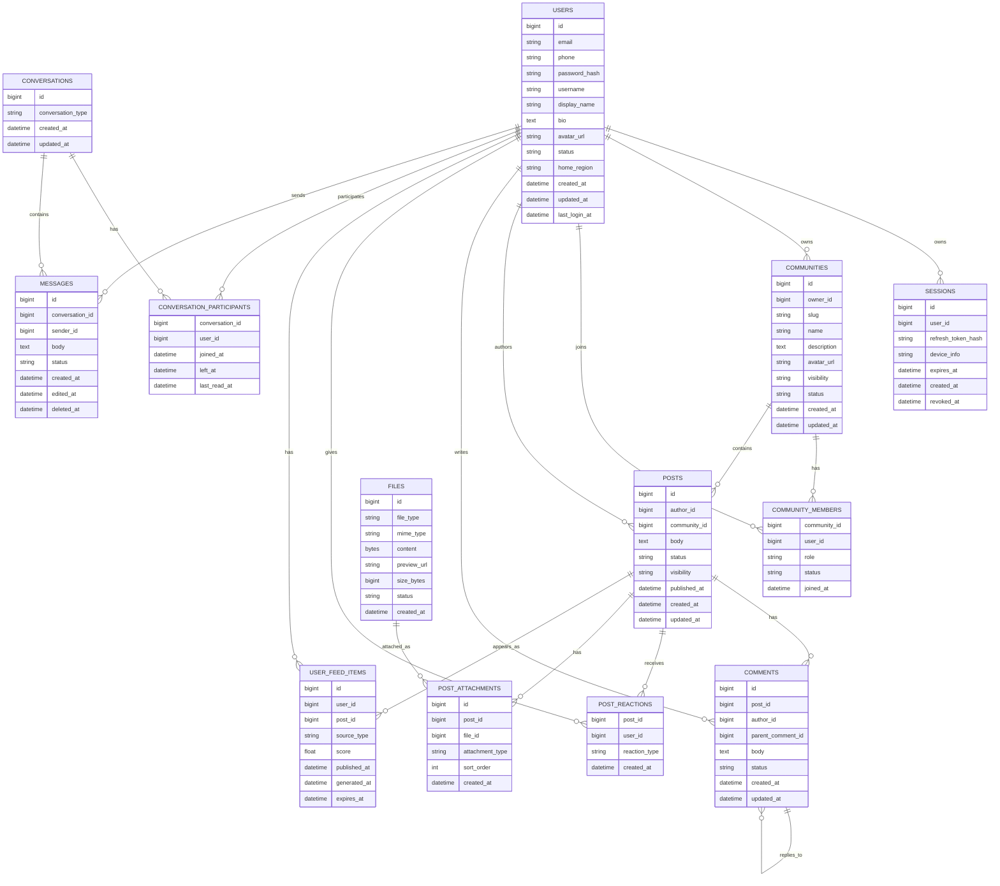

# 5. Логическая схема БД

- RPS avg = events_per_day / 86 400
- RPS peak = RPS avg \* 1.47
- QPS таблиц считается относительно RPS из [ДЗ 2](./02.md#rps):
    - если одно пользовательское действие обращается к одной таблице, то `QPS ~= RPS`;
    - если действие пишет несколько read-model или денормализованных таблиц, то `QPS = RPS * количество записей`;
    - для ленты используется fanout-on-write, поэтому QPS записи `user_feed_items` выше RPS публикации постов.

| Исходная метрика                        | Событий в сутки | RPS средний | RPS пиковый (K=1.47) |
| :-------------------------------------- | --------------: | ----------: | -------------------: |
| Авторизация VK ID                       |      16 666 667 |      192.90 |               283.56 |
| Публикация постов                       |      12 750 000 |      147.57 |               216.93 |
| Лайки                                   |   1 000 000 000 |   11 574.07 |            17 013.89 |
| Комментарии                             |      27 000 000 |      312.50 |               459.38 |
| Просмотренные посты _(по 10 за запрос)_ |     900 000 000 |   10 416.67 |            15 312.50 |
| Подписка на сообщества                  |         800 000 |        9.26 |                13.61 |
| Создание сообществ                      |          50 000 |        0.58 |                 0.85 |
| Сообщения в мессенджере                 |  15 000 000 000 |  173 611.11 |           255 208.33 |
| Поиск                                   |      70 000 000 |      810.19 |             1 190.97 |
| Создание профиля                        |         100 000 |        1.16 |                 1.70 |
| **Итого**                               |  17 027 366 667 |  197 076.00 |       **289 701.72** |

`Количество строк` в таблице ниже - это оценка объёма хранимых данных.
Она считается от продуктовых метрик из [ДЗ 2](./02.md):

- пользователи, сессии, сообщества - оценка набора сущностей;
- посты, комментарии, лайки, сообщения - накопленный объём событий за период хранения;
- лента, участники, вложения - производные read-model, где одна пользовательская операция может создавать несколько строк.

`Количество строк` отражает общий объём хранения, а QPS - пиковую нагрузку на чтение/запись этих строк.

| Таблица                         | Описание                                     | Размер строки                                                                                                                                                  | Количество строк | Размер таблицы | Нагрузка на запись, QPS пик | Нагрузка на чтение, QPS пик |
| :------------------------------ | :------------------------------------------- | :------------------------------------------------------------------------------------------------------------------------------------------------------------- | :--------------- | :------------- | :-------------------------- | :-------------------------- |
| **`users`**                     | Пользователи и публичный профиль             | id(8) + email(64) + phone(16) + password_hash(64) + username(32) + display_name(64) + bio(256) + avatar_url(128) + status(16) + region(16) + dates(24) ≈ 688 Б | 100 млн          | ≈ 69 ГБ        | 1.70                        | 15 600                      |
| **`sessions`**                  | Пользовательские сессии                      | id(8) + user_id(8) + token_hash(64) + device_info(128) + dates(24) ≈ 232 Б                                                                                     | 200 млн          | ≈ 46 ГБ        | 283.56                      | 289 702                     |
| **`communities`**               | Сообщества, группы, публичные страницы       | id(8) + owner_id(8) + slug(64) + name(128) + description(512) + avatar_url(128) + visibility/status(32) + dates(16) ≈ 896 Б                                    | 5 млн            | ≈ 4,5 ГБ       | 0.85                        | 15 313                      |
| **`community_members`**         | Связь пользователей и сообществ              | community_id(8) + user_id(8) + role(16) + status(16) + joined_at(8) ≈ 56 Б                                                                                     | 1 млрд           | ≈ 56 ГБ        | 13.61                       | 15 313                      |
| **`posts`**                     | Посты пользователей и сообществ              | id(8) + author_id(8) + community_id(8) + body(1 000) + status(16) + visibility(16) + dates(24) ≈ 1 080 Б                                                       | 10 млрд          | ≈ 10,8 ТБ      | 216.93                      | 15 313                      |
| **`comments`**                  | Комментарии к постам, включая ответы         | id(8) + post_id(8) + author_id(8) + parent_id(8) + body(500) + status(16) + dates(16) ≈ 564 Б                                                                  | 30 млрд          | ≈ 16,9 ТБ      | 459.38                      | 15 313                      |
| **`post_reactions`**            | Лайки на посты                               | post_id(8) + user_id(8) + reaction_type(8) + created_at(8) ≈ 32 Б                                                                                              | 100 млрд         | ≈ 3,2 ТБ       | 17 013.89                   | 15 313                      |
| **`files`**                     | Файлы: изображения, видео, аватары, вложения | id(8) + file_type(16) + mime_type(32) + content(200 КБ) + preview_url(128) + size(8) + status(16) + created_at(8) ≈ 200 КБ                                     | 2 млрд           | ≈ 400 ПБ       | 216.93                      | 15 313                      |
| **`post_attachments`**          | Связь постов и файлов                        | id(8) + post_id(8) + file_id(8) + type(16) + sort_order(4) + created_at(8) ≈ 52 Б                                                                              | 2 млрд           | ≈ 104 ГБ       | 1 000                       | 15 313                      |
| **`user_feed_items`**           | Персональная лента пользователя              | id(8) + user_id(8) + post_id(8) + source_type(16) + score(8) + dates(24) ≈ 72 Б                                                                                | 300 млрд         | ≈ 21,6 ТБ      | 100 000                     | 15 313                      |
| **`conversations`**             | Диалоги и групповые переписки                | id(8) + type(16) + dates(16) ≈ 40 Б                                                                                                                            | 1 млрд           | ≈ 40 ГБ        | 255 208.33                  | 255 208                     |
| **`conversation_participants`** | Участники переписок                          | conversation_id(8) + user_id(8) + dates(24) ≈ 40 Б                                                                                                             | 5 млрд           | ≈ 200 ГБ       | 255 208.33                  | 255 208                     |
| **`messages`**                  | Личные и групповые сообщения                 | id(8) + conversation_id(8) + sender_id(8) + body(500) + status(16) + dates(24) ≈ 564 Б                                                                         | 100 млрд         | ≈ 56 ТБ        | 255 208.33                  | 255 208                     |

Примечания по QPS:

- `users` пишется при создании профиля, поэтому write QPS равен RPS создания профиля.
- `sessions` пишется при авторизации, а читается почти на каждый авторизованный API-запрос.
- `posts`, `comments`, `post_reactions`, `community_members` пишутся напрямую из соответствующих действий в ДЗ 2.
- `files` и `post_attachments` привязаны к публикации поста. Для `post_attachments` учтено несколько вложений на один пост.
- `user_feed_items` пишется не одним пользовательским действием, а fanout-on-write: одна публикация порождает записи в ленты подписчиков.
- `messages` получает write QPS напрямую из RPS отправки сообщений. `conversations` и `conversation_participants` читаются/обновляются на пути отправки и чтения сообщений.

Strict Consistency:

- users - регистрация, авторизация, изменение профиля.
- sessions - проверка refresh-токенов и отзыв сессий.
- communities - создание и изменение сообщества.
- community_members - права доступа, вступление, выход, бан пользователя.
- posts - публикация, удаление, изменение статуса поста.
- comments - создание, удаление и изменение комментариев.
- post_reactions - уникальность реакции пользователя на пост.
- conversation_participants - права доступа к переписке.
- messages - отправка и чтение сообщений.

Eventual Consistency:

- files - допустима задержка между загрузкой файла и появлением превью или CDN-ссылки.
- post_attachments - допустима небольшая задержка при обработке вложений поста.
- user_feed_items - персональная лента может обновляться асинхронно и отставать от исходных постов на небольшое время.
