# 6. Физическая схема БД

- COMMUNITY_MEMBERS должна быть к user_profile
- messages идет на JOIN
- в мессаджес в копьюнити профили добавляем аватарку и картинку чтобы убрать JOIN . денормализируем = копируем данные
- в эластике храним превью аватарки и превью текста (берем N символов), пользователи (аватарка, ник), по постам кусок текста (не надо) и автор (его картинка). Разделить на две сущности
- Кафку выкинуть в 6
- Нужно полодить преьвю в сообщества
- Сам пост обновляется редко, а счетчики обновляются часто `posts.comments_count`. даже через JOIN
- Положить attachments в сам пост превьюха или (картинка кладем какк текст а фронт сам понимает) или храним массив всех прилинкованных картинок
- file object - можно убрать = s3 JOIN нормально
- рекомендер - реком
- от юзера хотим name и аватарку
- в comminity_members кладем данные юзераи данные о комьюнити
- tradeoff до ресурсов или tradeoff до скорости по дублированию данных
- в комменты кладем автора и аватарку
- ws connections удалить
- kafka, open search, redis удалить. нас интересует только БД
- обоснования
- перегрев counter

### Денормализация

- `USERS`: разделены на `USERS` для авторизации и `USER_PROFILES` для публичного профиля пользователя.

- `USER_PROFILES`: хранит `username`, `display_name`, `bio`, `avatar_url`, `avatar_preview_url`, город и страну. Эти данные копируются snapshot-полями в посты, комментарии, участников сообществ и сообщения.

- `COMMUNITIES`: добавлены snapshot-поля аватарки и счетчиков:
    - `avatar_preview_url`;
    - `members_count_snapshot`;
    - `posts_count_snapshot`;
    - `counters_updated_at`.

- `COMMUNITY_COUNTERS`: добавлена отдельная таблица для актуальных счетчиков сообщества:
    - `members_count`;
    - `posts_count`.

- `COMMUNITY_MEMBERS`: добавлены snapshot-поля пользователя и сообщества, чтобы читать список участников без JOIN:
    - `user_username_snapshot`;
    - `user_display_name_snapshot`;
    - `user_avatar_url_snapshot`;
    - `community_slug_snapshot`;
    - `community_name_snapshot`;
    - `community_avatar_url_snapshot`.

- `POSTS`: добавлены snapshot-поля автора, сообщества, вложений и счетчиков:
    - `author_username_snapshot`;
    - `author_display_name_snapshot`;
    - `author_avatar_url_snapshot`;
    - `community_slug_snapshot`;
    - `community_name_snapshot`;
    - `community_avatar_url_snapshot`;
    - `attachment_refs`;
    - `comments_count_snapshot`;
    - `reactions_count_snapshot`;
    - `counters_updated_at`.

- `POST_COUNTERS`: добавлена отдельная таблица для актуальных счетчиков поста:
    - `comments_count`;
    - `reactions_count`.

- `COMMENTS`: добавлены snapshot-поля автора комментария:
    - `author_username_snapshot`;
    - `author_display_name_snapshot`;
    - `author_avatar_url_snapshot`.

- `POST_REACTIONS`: разделена на две таблицы:
    - `POST_REACTIONS_BY_POST` - для уникальности реакции на пост и списка лайкнувших;
    - `USER_REACTIONS_BY_USER` - для быстрого определения `is_liked_by_me` в ленте.

- `FILE_OBJECTS`: вместо хранения файла в БД хранит metadata файла:
    - `storage_bucket`;
    - `storage_key`;
    - `cdn_url`;
    - `preview_url`;
    - `mime_type`;
    - `size_bytes`;
    - `checksum`.

- `POST_ATTACHMENTS`: добавлены snapshot-поля файла, чтобы читать вложения без JOIN к `FILE_OBJECTS`:
    - `cdn_url_snapshot`;
    - `preview_url_snapshot`;
    - `mime_type_snapshot`;
    - `size_bytes_snapshot`.

- `USER_FEED_ITEMS`: стала готовой карточкой поста для персональной ленты. Добавлены snapshot-поля:
    - тела поста;
    - автора;
    - сообщества;
    - вложений;
    - счетчиков комментариев и реакций.

- `POPULAR_FEED_ITEMS`: добавлена отдельная read-model для популярной ленты. Хранит готовые карточки популярных постов без JOIN.

- `CONVERSATION_PARTICIPANTS`: добавлены snapshot-поля участника:
    - `user_username_snapshot`;
    - `user_display_name_snapshot`;
    - `user_avatar_url_snapshot`.

- `USER_CONVERSATIONS`: добавлена read-model inbox пользователя:
    - последнее сообщение;
    - отправитель последнего сообщения;
    - `unread_count`.

- `MESSAGES`: добавлены snapshot-поля отправителя:
    - `sender_username_snapshot`;
    - `sender_display_name_snapshot`;
    - `sender_avatar_url_snapshot`.

### Счетчики

Мы выносим счетчики в отдельные таблицы как canonical source,
а в основных таблицах храним snapshot-значения.

Пример: лайк поста

- Пишем лайк в `POST_REACTIONS_BY_POST`.
- Пишем лайк в `USER_REACTIONS_BY_USER`.
- Инкрементим `POST_COUNTERS.reactions_count`.
- Асинхронно обновляем snapshot:
    - `POSTS.reactions_count_snapshot`
    - `USER_FEED_ITEMS.reactions_count_snapshot`
    - `POPULAR_FEED_ITEMS.reactions_count_snapshot`

```mermaid
erDiagram

    USERS {
        bigint id PK
        varchar email UK
        varchar phone UK
        varchar password_hash
        smallint status
        varchar home_region
        timestamptz created_at
        timestamptz updated_at
        timestamptz last_login_at
    }

    USER_PROFILES {
        bigint user_id PK
        varchar username UK
        varchar display_name
        text bio
        varchar avatar_url
        varchar avatar_preview_url
        varchar city
        varchar country
        timestamptz created_at
        timestamptz updated_at
    }

    USER_SESSIONS {
        varchar key PK
        bigint user_id
        varchar refresh_token_hash
        varchar device_info
        timestamptz expires_at
        timestamptz created_at
        timestamptz revoked_at
    }

    COMMUNITIES {
        bigint id PK
        bigint owner_id
        varchar slug UK
        varchar name
        text description
        varchar avatar_url
        varchar avatar_preview_url
        smallint visibility
        smallint status

        bigint members_count_snapshot
        bigint posts_count_snapshot
        timestamptz counters_updated_at

        timestamptz created_at
        timestamptz updated_at
    }

    COMMUNITY_COUNTERS {
        bigint community_id PK
        bigint members_count
        bigint posts_count
        timestamptz updated_at
    }

    COMMUNITY_MEMBERS {
        bigint community_id PK
        bigint user_id PK
        smallint role
        smallint status
        timestamptz joined_at

        varchar user_username_snapshot
        varchar user_display_name_snapshot
        varchar user_avatar_url_snapshot

        varchar community_slug_snapshot
        varchar community_name_snapshot
        varchar community_avatar_url_snapshot
    }

    POSTS {
        bigint id PK
        bigint author_id
        bigint community_id

        text body
        smallint status
        smallint visibility

        varchar author_username_snapshot
        varchar author_display_name_snapshot
        varchar author_avatar_url_snapshot

        varchar community_slug_snapshot
        varchar community_name_snapshot
        varchar community_avatar_url_snapshot

        jsonb attachment_refs

        bigint comments_count_snapshot
        bigint reactions_count_snapshot
        timestamptz counters_updated_at

        timestamptz published_at
        timestamptz created_at
        timestamptz updated_at
    }

    POST_COUNTERS {
        bigint post_id PK
        bigint comments_count
        bigint reactions_count
        timestamptz updated_at
    }

    COMMENTS {
        bigint post_id PK
        bigint id PK

        bigint author_id
        bigint parent_comment_id

        text body
        smallint status

        varchar author_username_snapshot
        varchar author_display_name_snapshot
        varchar author_avatar_url_snapshot

        timestamptz created_at
        timestamptz updated_at
    }

    POST_REACTIONS_BY_POST {
        bigint post_id PK
        bigint user_id PK
        smallint reaction_type
        timestamptz created_at
    }

    USER_REACTIONS_BY_USER {
        bigint user_id PK
        bigint post_id PK
        smallint reaction_type
        timestamptz created_at
    }

    FILE_OBJECTS {
        bigint id PK
        smallint file_type
        varchar mime_type
        varchar storage_bucket
        varchar storage_key
        varchar cdn_url
        varchar preview_url
        bigint size_bytes
        varchar checksum
        smallint status
        timestamptz created_at
        timestamptz updated_at
    }

    POST_ATTACHMENTS {
        bigint post_id PK
        int sort_order PK
        bigint file_id
        smallint attachment_type
        varchar cdn_url_snapshot
        varchar preview_url_snapshot
        varchar mime_type_snapshot
        bigint size_bytes_snapshot
        timestamptz created_at
    }

    USER_FEED_ITEMS {
        bigint user_id PK
        timestamptz published_at PK
        bigint post_id PK

        bigint author_id
        bigint community_id

        text post_body_snapshot

        varchar author_username_snapshot
        varchar author_display_name_snapshot
        varchar author_avatar_url_snapshot

        varchar community_slug_snapshot
        varchar community_name_snapshot
        varchar community_avatar_url_snapshot

        jsonb attachment_refs_snapshot

        bigint comments_count_snapshot
        bigint reactions_count_snapshot

        double score
        varchar source_type

        timestamptz generated_at
        timestamptz expires_at
    }

    POPULAR_FEED_ITEMS {
        varchar feed_region PK
        timestamptz score_bucket PK
        double score
        bigint post_id PK

        bigint author_id
        bigint community_id

        text post_body_snapshot

        varchar author_username_snapshot
        varchar author_display_name_snapshot
        varchar author_avatar_url_snapshot

        varchar community_slug_snapshot
        varchar community_name_snapshot
        varchar community_avatar_url_snapshot

        jsonb attachment_refs_snapshot

        bigint comments_count_snapshot
        bigint reactions_count_snapshot

        timestamptz generated_at
    }

    CONVERSATIONS {
        bigint id PK
        smallint conversation_type
        timestamptz created_at
        timestamptz updated_at
    }

    CONVERSATION_PARTICIPANTS {
        bigint conversation_id PK
        bigint user_id PK

        smallint status

        varchar user_username_snapshot
        varchar user_display_name_snapshot
        varchar user_avatar_url_snapshot

        timestamptz joined_at
        timestamptz left_at
        timestamptz last_read_at
    }

    USER_CONVERSATIONS {
        bigint user_id PK
        timestamptz last_message_at PK
        bigint conversation_id PK

        bigint last_message_id
        text last_message_body_snapshot
        bigint last_message_sender_id
        varchar last_message_sender_name_snapshot

        int unread_count

        timestamptz updated_at
    }

    MESSAGES {
        bigint conversation_id PK
        bigint id PK

        bigint sender_id
        text body
        smallint status

        varchar sender_username_snapshot
        varchar sender_display_name_snapshot
        varchar sender_avatar_url_snapshot

        timestamptz created_at
        timestamptz edited_at
        timestamptz deleted_at
    }

    USERS ||--|| USER_PROFILES : has
    USERS ||--o{ USER_SESSIONS : owns

    USERS ||--o{ COMMUNITIES : owns
    COMMUNITIES ||--|| COMMUNITY_COUNTERS : has

    USERS ||--o{ COMMUNITY_MEMBERS : joins
    COMMUNITIES ||--o{ COMMUNITY_MEMBERS : has

    USERS ||--o{ POSTS : authors
    COMMUNITIES ||--o{ POSTS : contains

    POSTS ||--|| POST_COUNTERS : has

    POSTS ||--o{ COMMENTS : has
    USERS ||--o{ COMMENTS : writes

    POSTS ||--o{ POST_REACTIONS_BY_POST : receives
    USERS ||--o{ POST_REACTIONS_BY_POST : gives

    USERS ||--o{ USER_REACTIONS_BY_USER : has
    POSTS ||--o{ USER_REACTIONS_BY_USER : liked_as

    POSTS ||--o{ POST_ATTACHMENTS : has
    FILE_OBJECTS ||--o{ POST_ATTACHMENTS : attached_as

    USERS ||--o{ USER_FEED_ITEMS : has
    POSTS ||--o{ USER_FEED_ITEMS : appears_as

    POSTS ||--o{ POPULAR_FEED_ITEMS : appears_as

    CONVERSATIONS ||--o{ CONVERSATION_PARTICIPANTS : has
    USERS ||--o{ CONVERSATION_PARTICIPANTS : participates

    USERS ||--o{ USER_CONVERSATIONS : has
    CONVERSATIONS ||--o{ USER_CONVERSATIONS : appears_as

    CONVERSATIONS ||--o{ MESSAGES : contains
    USERS ||--o{ MESSAGES : sends
```

### Выбор СУБД для таблиц

| Таблица                     | СУБД / хранилище       | Обоснование                                                  |
| :-------------------------- | :--------------------- | :----------------------------------------------------------- |
| `users`                     | PostgreSQL             | Строгая консистентность, уникальность email/phone            |
| `user_profiles`             | PostgreSQL             | Профильные данные, уникальность username                     |
| `user_sessions`             | Redis                  | TTL, быстрые проверки авторизации                            |
| `communities`               | PostgreSQL             | Метаданные сообществ, владельцы, статусы                     |
| `community_counters`        | PostgreSQL             | Каноничные счетчики сообщества                               |
| `community_members`         | ScyllaDB               | Большой объём подписок, чтение по `community_id` и `user_id` |
| `posts`                     | ScyllaDB               | Большой объём постов, чтение по `community_id` и `author_id` |
| `post_counters`             | ScyllaDB / Redis       | Часто обновляемые счетчики постов                            |
| `comments`                  | ScyllaDB               | Высокая нагрузка, чтение комментариев по `post_id`           |
| `post_reactions_by_post`    | ScyllaDB               | Уникальность реакции на пост, список лайкнувших              |
| `user_reactions_by_user`    | ScyllaDB               | Быстрая проверка `is_liked_by_me`                            |
| `file_objects`              | PostgreSQL             | Метаданные файлов и ссылки на объектное хранилище            |
| `file_payloads`             | SeaweedFS / S3 / MinIO | Хранение тяжелого бинарного контента                         |
| `post_attachments`          | ScyllaDB               | Вложения читаются по `post_id`                               |
| `user_feed_items`           | ScyllaDB               | Персональная лента шардируется по `user_id`                  |
| `popular_feed_items`        | ScyllaDB / Redis       | Популярная лента по региону и временному bucket              |
| `conversations`             | PostgreSQL             | Метаданные диалогов                                          |
| `conversation_participants` | ScyllaDB               | Проверка доступа к перепискам и список участников            |
| `user_conversations`        | ScyllaDB               | Read-model inbox пользователя                                |
| `messages`                  | ScyllaDB               | Высокая нагрузка на историю сообщений                        |
| `search_index_entries`      | OpenSearch             | Полнотекстовый поиск                                         |
| `event_outbox`              | PostgreSQL + Kafka     | Надежная запись событий и асинхронная доставка               |

### Индексы

| Тип / поле                 | Размер         |
| :------------------------- | :------------- |
| `bigint`                   | 8 Б            |
| `int`                      | 4 Б            |
| `smallint`                 | 2 Б            |
| `timestamptz` / `datetime` | 8 Б            |
| `float` / `double`         | 8 Б            |
| `email`                    | 64 Б           |
| `phone`                    | 16 Б           |
| `username`                 | 32 Б           |
| `slug`                     | 64 Б           |
| `storage_key`              | 128 Б          |
| Redis token key            | 64 Б           |
| Служебные данные индекса   | 16 Б на запись |

Размер индекса = rows \* (key_size + 16 Б)

| Таблица / структура                 | Ключ / индекс                                                                   | Тип                        | Обоснование                               | Количество строк | Размер ключа | Расчёт                          | Размер |
| :---------------------------------- | :------------------------------------------------------------------------------ | :------------------------- | :---------------------------------------- | :--------------- | :----------- | :------------------------------ | :----- |
| `users`                             | `id`                                                                            | B-Tree / PK                | Поиск пользователя по ID                  | 100 млн          | 8 Б          | 100 млн × (8 + 16)              | 2,4 ГБ |
| `users`                             | `email`                                                                         | Unique B-Tree              | Авторизация и уникальность email          | 100 млн          | 64 Б         | 100 млн × (64 + 16)             | 8,0 ГБ |
| `users`                             | `phone`                                                                         | Unique B-Tree              | Авторизация по телефону                   | 100 млн          | 16 Б         | 100 млн × (16 + 16)             | 3,2 ГБ |
| `user_profiles`                     | `user_id`                                                                       | B-Tree / PK                | Получение профиля пользователя            | 100 млн          | 8 Б          | 100 млн × (8 + 16)              | 2,4 ГБ |
| `user_profiles`                     | `username`                                                                      | Unique B-Tree              | Поиск по username                         | 100 млн          | 32 Б         | 100 млн × (32 + 16)             | 4,8 ГБ |
| `communities`                       | `id`                                                                            | B-Tree / PK                | Получение сообщества                      | 5 млн            | 8 Б          | 5 млн × (8 + 16)                | 120 МБ |
| `communities`                       | `slug`                                                                          | Unique B-Tree              | Поиск сообщества по URL                   | 5 млн            | 64 Б         | 5 млн × (64 + 16)               | 400 МБ |
| `community_counters`                | `community_id`                                                                  | B-Tree / PK                | Получение счетчиков сообщества            | 5 млн            | 8 Б          | 5 млн × (8 + 16)                | 120 МБ |
| `community_members`                 | `partition key: community_id, clustering key: user_id`                          | Primary Key ScyllaDB       | Список участников сообщества              | 1 млрд           | 16 Б         | включён в объём таблицы         | —      |
| `community_members_by_user`         | `partition key: user_id, clustering key: community_id`                          | Отдельная таблица ScyllaDB | Список сообществ пользователя             | 1 млрд           | 16 Б         | включён в объём таблицы         | —      |
| `posts`                             | `partition key: community_id, clustering key: published_at DESC, id`            | Primary Key ScyllaDB       | Чтение ленты сообщества                   | 10 млрд          | 24 Б         | включён в объём таблицы         | —      |
| `posts_by_author`                   | `partition key: author_id, clustering key: published_at DESC, id`               | Отдельная таблица ScyllaDB | Чтение постов автора                      | 10 млрд          | 24 Б         | включён в объём таблицы         | —      |
| `post_counters`                     | `partition key: post_id`                                                        | Primary Key ScyllaDB       | Получение счетчиков поста                 | 10 млрд          | 8 Б          | включён в объём таблицы         | —      |
| `comments`                          | `partition key: post_id, clustering key: created_at, id`                        | Primary Key ScyllaDB       | Чтение комментариев поста                 | 30 млрд          | 24 Б         | включён в объём таблицы         | —      |
| `post_reactions_by_post`            | `partition key: post_id, clustering key: user_id`                               | Primary Key ScyllaDB       | Список реакций поста                      | 100 млрд         | 16 Б         | включён в объём таблицы         | —      |
| `user_reactions_by_user`            | `partition key: user_id, clustering key: post_id`                               | Primary Key ScyllaDB       | Проверка лайка пользователя               | 100 млрд         | 16 Б         | включён в объём таблицы         | —      |
| `file_objects`                      | `id`                                                                            | B-Tree / PK                | Получение метаданных файла                | 2 млрд           | 8 Б          | 2 млрд × (8 + 16)               | 48 ГБ  |
| `file_objects`                      | `storage_key`                                                                   | Unique B-Tree              | Связь метаданных с объектным хранилищем   | 2 млрд           | 128 Б        | 2 млрд × (128 + 16)             | 288 ГБ |
| `post_attachments`                  | `partition key: post_id, clustering key: sort_order`                            | Primary Key ScyllaDB       | Получение вложений поста в нужном порядке | 2 млрд           | 12 Б         | включён в объём таблицы         | —      |
| `user_feed_items`                   | `partition key: user_id, clustering key: published_at DESC, post_id`            | Primary Key ScyllaDB       | Чтение персональной ленты                 | 300 млрд         | 24 Б         | включён в объём таблицы         | —      |
| `popular_feed_items`                | `partition key: feed_region, clustering key: score_bucket, post_id`             | Primary Key ScyllaDB       | Чтение популярной ленты                   | 1 млрд           | 80 Б         | включён в объём таблицы         | —      |
| `user_sessions`                     | `session:{key}`                                                                 | Redis Key                  | Проверка сессии по ключу                  | 200 млн          | 64 Б         | 200 млн × ~250 Б                | 50 ГБ  |
| `conversations`                     | `id`                                                                            | B-Tree / PK                | Получение диалога                         | 1 млрд           | 8 Б          | 1 млрд × (8 + 16)               | 24 ГБ  |
| `conversation_participants`         | `partition key: conversation_id, clustering key: user_id`                       | Primary Key ScyllaDB       | Проверка доступа к диалогу                | 5 млрд           | 16 Б         | включён в объём таблицы         | —      |
| `conversation_participants_by_user` | `partition key: user_id, clustering key: conversation_id`                       | Отдельная таблица ScyllaDB | Список диалогов пользователя              | 5 млрд           | 16 Б         | включён в объём таблицы         | —      |
| `user_conversations`                | `partition key: user_id, clustering key: last_message_at DESC, conversation_id` | Primary Key ScyllaDB       | Inbox пользователя                        | 1 млрд           | 24 Б         | включён в объём таблицы         | —      |
| `messages`                          | `partition key: conversation_id, clustering key: id DESC`                       | Primary Key ScyllaDB       | Чтение истории сообщений                  | 100 млрд         | 16 Б         | включён в объём таблицы         | —      |
| `search_index_entries`              | `searchable_text`                                                               | Inverted Index OpenSearch  | Полнотекстовый поиск                      | 15 млрд          | text         | 20–50% от индексируемого текста | 3–8 ТБ |
| `event_outbox`                      | `(status, created_at)`                                                          | B-Tree                     | Выборка необработанных событий            | 100 млн active   | 10 Б         | 100 млн × (10 + 16)             | 2,6 ГБ |

Для ScyllaDB отдельные B-Tree индексы не считаются. Primary key и clustering key входят в физическое хранение таблицы.

### Шардирование

| Таблица                             | СУБД          | Ключ шардирования             | Обоснование                                           |
| :---------------------------------- | :------------ | :---------------------------- | :---------------------------------------------------- |
| `users`                             | PostgreSQL    | `id`                          | Равномерное распределение пользователей               |
| `user_profiles`                     | PostgreSQL    | `user_id`                     | Профиль лежит рядом с пользователем                   |
| `user_sessions`                     | Redis Cluster | `key`                         | Быстрая проверка сессии                               |
| `communities`                       | PostgreSQL    | `id`                          | Метаданные сообщества распределяются равномерно       |
| `community_counters`                | PostgreSQL    | `community_id`                | Счетчики лежат рядом с сообществом                    |
| `community_members`                 | ScyllaDB      | `community_id`                | Быстрое чтение участников сообщества                  |
| `community_members_by_user`         | ScyllaDB      | `user_id`                     | Быстрое чтение сообществ пользователя                 |
| `posts`                             | ScyllaDB      | `community_id`                | Быстрое чтение ленты сообщества                       |
| `posts_by_author`                   | ScyllaDB      | `author_id`                   | Быстрое чтение постов автора                          |
| `post_counters`                     | ScyllaDB      | `post_id`                     | Быстрое получение счетчиков поста                     |
| `comments`                          | ScyllaDB      | `post_id`                     | Быстрое чтение комментариев поста                     |
| `post_reactions_by_post`            | ScyllaDB      | `post_id`                     | Список реакций поста                                  |
| `user_reactions_by_user`            | ScyllaDB      | `user_id`                     | Проверка лайков пользователя                          |
| `file_objects`                      | PostgreSQL    | `id`                          | Метаданные файлов распределяются равномерно           |
| `file_payloads`                     | SeaweedFS     | `storage_key`                 | Равномерное распределение объектов                    |
| `post_attachments`                  | ScyllaDB      | `post_id`                     | Вложения поста читаются вместе с постом               |
| `user_feed_items`                   | ScyllaDB      | `user_id`                     | Персональная лента пользователя                       |
| `popular_feed_items`                | ScyllaDB      | `feed_region`                 | Популярная лента по региону                           |
| `conversations`                     | PostgreSQL    | `id`                          | Метаданные диалогов распределяются равномерно         |
| `conversation_participants`         | ScyllaDB      | `conversation_id`             | Проверка участников диалога                           |
| `conversation_participants_by_user` | ScyllaDB      | `user_id`                     | Список диалогов пользователя                          |
| `user_conversations`                | ScyllaDB      | `user_id`                     | Inbox пользователя                                    |
| `messages`                          | ScyllaDB      | `conversation_id`             | История переписки лежит в одной партиции              |
| `event_outbox`                      | PostgreSQL    | `created_at` / `aggregate_id` | Батчевая обработка событий и удаление старых партиций |

### Резервирование

| СУБД       | Схема                                                                                   | Обоснование                                         |
| :--------- | :-------------------------------------------------------------------------------------- | :-------------------------------------------------- |
| PostgreSQL | 1 ДЦ пишем, 2 - реплики. Внутри master ДЦ 3, внутри slave ДЦ 3 и failover через Patroni | Надёжность и распределение чтения                   |
| ScyllaDB   | Replication Factor = 3, consistency level LOCAL_QUORUM                                  | Отказоустойчивость и высокая пропускная способность |
| S3         | Репликация объектов между зонами доступности                                            | Защита файлов от потери                             |
