# 6. Физическая схема БД

### Денормализация

1. Таблица `users` из логической схемы делится на `users` и `user_profiles`.
   В `users` остаются данные авторизации: email, phone, password_hash, status.
   В `user_profiles` выносятся username, display_name, bio, avatar_file_id, cover_file_id, city, country.

2. Таблица `files` из логической схемы делится на:
    - `file_objects` - метаданные файла;
    - `file_payloads` / объектное хранилище - фактическое содержимое файла.

3. Логическая таблица `user_feed_items` в физической схеме хранится в денормализованном виде.
   В ней дополнительно сохраняются snapshot-данные, чтобы при чтении ленты не выполнять JOIN с `posts`, `users`, `communities` и `post_attachments`:
    - `post_body_snapshot`;
    - `author_display_name_snapshot`;
    - `community_name_snapshot`;
    - `attachment_refs`.

4. Для постов и сообществ добавляются денормализованные счётчики:
    - `posts.comments_count`;
    - `posts.reactions_count`;
    - `communities.members_count`.

    Счётчики позволяют отображать количество комментариев, реакций и участников без выполнения дорогих `COUNT(*)` по большим таблицам.

5. Для поиска используется отдельный физический индекс `search_index_entries`, который обновляется асинхронно через `event_outbox`.

6. Для WebSocket-подключений используется отдельная временная структура `ws_connections`, физически размещённая в Redis.

```mermaid
erDiagram

    USERS {
        bigint id PK
        varchar email UK
        varchar phone UK
        varchar password_hash
        smallint status
        varchar home_region
        timestamptz created_at
        timestamptz updated_at
        timestamptz last_login_at
    }

    USER_PROFILES {
        bigint user_id PK
        varchar username UK
        varchar display_name
        text bio
        bigint avatar_file_id FK
        bigint cover_file_id FK
        varchar city
        varchar country
        timestamptz created_at
        timestamptz updated_at
    }

    COMMUNITIES {
        bigint id PK
        bigint owner_id
        varchar slug UK
        varchar name
        text description
        bigint avatar_file_id
        bigint cover_file_id
        smallint visibility
        smallint status
        int members_count
        timestamptz created_at
        timestamptz updated_at
    }

    COMMUNITY_MEMBERS {
        bigint community_id PK
        bigint user_id PK
        smallint role
        smallint status
        timestamptz joined_at
    }

    POSTS {
        bigint id PK
        bigint author_id
        bigint community_id
        text body
        smallint status
        smallint visibility
        int comments_count
        int reactions_count
        timestamptz published_at
        timestamptz created_at
        timestamptz updated_at
    }

    COMMENTS {
        bigint post_id PK
        bigint id PK
        bigint author_id
        bigint parent_comment_id
        text body
        smallint status
        timestamptz created_at
        timestamptz updated_at
    }

    POST_REACTIONS {
        bigint post_id PK
        bigint user_id PK
        smallint reaction_type
        timestamptz created_at
    }

    USER_FEED_ITEMS {
        bigint user_id PK
        bigint id PK
        bigint post_id
        text post_body_snapshot
        varchar author_display_name_snapshot
        varchar community_name_snapshot
        jsonb attachment_refs
        double score
        timestamptz published_at
        timestamptz generated_at
        timestamptz expires_at
    }

    FILE_OBJECTS {
        bigint id PK
        smallint file_type
        varchar mime_type
        varchar storage_key
        varchar cdn_url
        varchar preview_url
        bigint size_bytes
        smallint status
        timestamptz created_at
    }

    FILE_PAYLOADS {
        varchar storage_key PK
        bytes content
        varchar checksum
        timestamptz created_at
    }

    POST_ATTACHMENTS {
        bigint id PK
        bigint post_id
        bigint file_id
        smallint attachment_type
        int sort_order
        timestamptz created_at
    }

    USER_SESSIONS {
        string key PK
        bigint user_id
        string refresh_token_hash
        timestamptz expires_at
    }

    WS_CONNECTIONS {
        bigint user_id PK
        string socket_id PK
        string server_id
        timestamptz expires_at
    }

    SEARCH_INDEX_ENTRIES {
        bigint id PK
        string entity_type
        bigint entity_id
        text searchable_text
        smallint status
        timestamptz updated_at
    }

    EVENT_OUTBOX {
        bigint id PK
        string event_type
        string aggregate_type
        bigint aggregate_id
        jsonb payload
        smallint status
        timestamptz created_at
        timestamptz processed_at
    }

    CONVERSATIONS {
        bigint id PK
        smallint conversation_type
        timestamptz created_at
        timestamptz updated_at
    }

    CONVERSATION_PARTICIPANTS {
        bigint conversation_id PK
        bigint user_id PK
        timestamptz joined_at
        timestamptz left_at
        timestamptz last_read_at
    }

    MESSAGES {
        bigint conversation_id PK
        bigint id PK
        bigint sender_id
        text body
        smallint status
        timestamptz created_at
        timestamptz edited_at
        timestamptz deleted_at
    }

    USERS ||--|| USER_PROFILES : has
    USERS ||--o{ COMMUNITY_MEMBERS : joins
    COMMUNITIES ||--o{ COMMUNITY_MEMBERS : has

    USERS ||--o{ POSTS : authors
    COMMUNITIES ||--o{ POSTS : contains

    POSTS ||--o{ COMMENTS : has
    USERS ||--o{ COMMENTS : writes

    POSTS ||--o{ POST_REACTIONS : receives
    USERS ||--o{ POST_REACTIONS : gives

    POSTS ||--o{ POST_ATTACHMENTS : has
    FILE_OBJECTS ||--o{ POST_ATTACHMENTS : attached_as
    FILE_OBJECTS ||--|| FILE_PAYLOADS : stored_as

    USERS ||--o{ USER_FEED_ITEMS : has
    POSTS ||--o{ USER_FEED_ITEMS : appears_as

    CONVERSATIONS ||--o{ CONVERSATION_PARTICIPANTS : has
    USERS ||--o{ CONVERSATION_PARTICIPANTS : participates
    CONVERSATIONS ||--o{ MESSAGES : contains
    USERS ||--o{ MESSAGES : sends

    USERS ||--o{ USER_SESSIONS : owns
    USERS ||--o{ WS_CONNECTIONS : opens
```

### Выбор СУБД для таблиц

| Таблица                     | СУБД / хранилище                  | Обоснование                                                                      |
| :-------------------------- | :-------------------------------- | :------------------------------------------------------------------------------- |
| `users`                     | PostgreSQL                        | Строгая консистентность, уникальность email/phone                                |
| `user_profiles`             | PostgreSQL                        | Профильные данные, связи с файлами                                               |
| `communities`               | PostgreSQL                        | Метаданные сообществ, владельцы, статусы                                         |
| `community_members`         | PostgreSQL / ScyllaDB             | При небольших сообществах PostgreSQL, при огромном числе подписок лучше ScyllaDB |
| `posts`                     | ScyllaDB                          | Большой объём записей и чтений по `community_id` / `author_id`                   |
| `comments`                  | ScyllaDB                          | Высокая нагрузка, чтение комментариев по `post_id`                               |
| `post_reactions`            | ScyllaDB / Cassandra-like storage | Очень много однотипных записей, ключ `(post_id, user_id)`                        |
| `user_feed_items`           | ScyllaDB                          | Персональная лента хорошо шардируется по `user_id`                               |
| `file_objects`              | PostgreSQL                        | Метаданные файлов и ссылки на объектное хранилище                                |
| `file_payloads`             | S3 / MinIO                        | Хранение тяжёлого бинарного контента                                             |
| `post_attachments`          | PostgreSQL / ScyllaDB             | Связь постов с файлами                                                           |
| `user_sessions`             | Redis                             | TTL, быстрые проверки авторизации                                                |
| `ws_connections`            | Redis                             | Временные данные активных соединений                                             |
| `search_index_entries`      | Elasticsearch / OpenSearch        | Полнотекстовый поиск                                                             |
| `event_outbox`              | PostgreSQL + Kafka                | Надёжная запись событий и асинхронная доставка                                   |
| `conversations`             | PostgreSQL                        | Метаданные диалогов                                                              |
| `conversation_participants` | PostgreSQL / ScyllaDB             | Проверка доступа к перепискам                                                    |
| `messages`                  | ScyllaDB                          | Высокая нагрузка на историю сообщений                                            |

### Индексы

| Тип / поле                 | Размер         |
| :------------------------- | :------------- |
| `bigint`                   | 8 Б            |
| `int`                      | 4 Б            |
| `smallint`                 | 2 Б            |
| `timestamptz` / `datetime` | 8 Б            |
| `float` / `double`         | 8 Б            |
| `email`                    | 64 Б           |
| `phone`                    | 16 Б           |
| `username`                 | 32 Б           |
| `slug`                     | 64 Б           |
| `storage_key`              | 128 Б          |
| Redis token key            | 64 Б           |
| Служебные данные индекса   | 16 Б на запись |

Размер индекса = rows \* (key_size + 16 Б)

| Таблица / структура         | Ключ / индекс                                                           | Тип                                            | Обоснование                                 | Количество строк | Размер ключа | Расчёт                          | Размер |
| :-------------------------- | :---------------------------------------------------------------------- | :--------------------------------------------- | :------------------------------------------ | :--------------- | :----------- | :------------------------------ | :----- |
| `users`                     | `id`                                                                    | B-Tree / PK                                    | Поиск пользователя по ID                    | 100 млн          | 8 Б          | 100 млн × (8 + 16)              | 2,4 ГБ |
| `users`                     | `email`                                                                 | Unique B-Tree                                  | Авторизация и уникальность email            | 100 млн          | 64 Б         | 100 млн × (64 + 16)             | 8,0 ГБ |
| `users`                     | `phone`                                                                 | Unique B-Tree                                  | Авторизация по телефону                     | 100 млн          | 16 Б         | 100 млн × (16 + 16)             | 3,2 ГБ |
| `user_profiles`             | `user_id`                                                               | B-Tree / PK                                    | Получение профиля пользователя              | 100 млн          | 8 Б          | 100 млн × (8 + 16)              | 2,4 ГБ |
| `user_profiles`             | `username`                                                              | Unique B-Tree                                  | Поиск по username                           | 100 млн          | 32 Б         | 100 млн × (32 + 16)             | 4,8 ГБ |
| `communities`               | `id`                                                                    | B-Tree / PK                                    | Получение сообщества                        | 5 млн            | 8 Б          | 5 млн × (8 + 16)                | 120 МБ |
| `communities`               | `slug`                                                                  | Unique B-Tree                                  | Поиск сообщества по URL                     | 5 млн            | 64 Б         | 5 млн × (64 + 16)               | 400 МБ |
| `community_members`         | `(community_id, user_id)`                                               | Composite B-Tree / PK                          | Проверка членства пользователя в сообществе | 1 млрд           | 16 Б         | 1 млрд × (16 + 16)              | 32 ГБ  |
| `community_members`         | `(user_id, community_id)`                                               | Composite B-Tree                               | Список сообществ пользователя               | 1 млрд           | 16 Б         | 1 млрд × (16 + 16)              | 32 ГБ  |
| `posts`                     | `partition key: community_id, clustering key: published_at DESC`        | Primary Key ScyllaDB                           | Чтение ленты сообщества                     | 10 млрд          | 16 Б         | 10 млрд × (16 + 16)             | 320 ГБ |
| `posts_by_author`           | `partition key: author_id, clustering key: published_at DESC`           | Materialized View / отдельная таблица ScyllaDB | Чтение постов автора                        | 10 млрд          | 16 Б         | 10 млрд × (16 + 16)             | 320 ГБ |
| `comments`                  | `partition key: post_id, clustering key: created_at`                    | Primary Key ScyllaDB                           | Чтение комментариев поста                   | 30 млрд          | 16 Б         | 30 млрд × (16 + 16)             | 960 ГБ |
| `post_reactions`            | `partition key: post_id, clustering key: user_id`                       | Primary Key ScyllaDB                           | Проверка лайка пользователя на посте        | 100 млрд         | 16 Б         | 100 млрд × (16 + 16)            | 3,2 ТБ |
| `user_feed_items`           | `partition key: user_id, clustering key: score DESC, published_at DESC` | Primary Key ScyllaDB                           | Чтение персональной ленты                   | 300 млрд         | 24 Б         | 300 млрд × (24 + 16)            | 12 ТБ  |
| `file_objects`              | `id`                                                                    | B-Tree / PK                                    | Получение метаданных файла                  | 2 млрд           | 8 Б          | 2 млрд × (8 + 16)               | 48 ГБ  |
| `file_objects`              | `storage_key`                                                           | Unique B-Tree                                  | Связь метаданных с объектным хранилищем     | 2 млрд           | 128 Б        | 2 млрд × (128 + 16)             | 288 ГБ |
| `post_attachments`          | `(post_id, sort_order)`                                                 | Composite B-Tree                               | Получение вложений поста в нужном порядке   | 2 млрд           | 12 Б         | 2 млрд × (12 + 16)              | 56 ГБ  |
| `user_sessions`             | `session:{token}`                                                       | Redis Key                                      | Проверка сессии по токену                   | 200 млн          | 64 Б         | 200 млн × ~250 Б                | 50 ГБ  |
| `ws_connections`            | `ws:{user_id}`                                                          | Redis Set                                      | Активные WebSocket-соединения пользователя  | 30 млн           | 64 Б         | 30 млн × ~120 Б                 | 3,6 ГБ |
| `search_index_entries`      | `searchable_text`                                                       | Inverted Index                                 | Полнотекстовый поиск                        | 15 млрд          | text         | 20–50% от индексируемого текста | 3–8 ТБ |
| `event_outbox`              | `(status, created_at)`                                                  | B-Tree                                         | Выборка необработанных событий              | 10 млрд          | 10 Б         | 10 млрд × (10 + 16)             | 260 ГБ |
| `conversations`             | `id`                                                                    | B-Tree / PK                                    | Получение диалога                           | 1 млрд           | 8 Б          | 1 млрд × (8 + 16)               | 24 ГБ  |
| `conversation_participants` | `(conversation_id, user_id)`                                            | Composite B-Tree / PK                          | Проверка доступа к диалогу                  | 5 млрд           | 16 Б         | 5 млрд × (16 + 16)              | 160 ГБ |
| `conversation_participants` | `(user_id, conversation_id)`                                            | Composite B-Tree                               | Список диалогов пользователя                | 5 млрд           | 16 Б         | 5 млрд × (16 + 16)              | 160 ГБ |
| `messages`                  | `partition key: conversation_id, clustering key: id DESC`               | Primary Key ScyllaDB                           | Чтение истории сообщений                    | 100 млрд         | 16 Б         | 100 млрд × (16 + 16)            | 3,2 ТБ |

### Шардирование

| Таблица             | СУБД                  | Ключ шардирования             | Обоснование                                                                        |
| :------------------ | :-------------------- | :---------------------------- | :--------------------------------------------------------------------------------- |
| `users`             | PostgreSQL            | `id`                          | Равномерное распределение пользователей                                            |
| `user_profiles`     | PostgreSQL            | `user_id`                     | Профиль лежит рядом с пользователем                                                |
| `communities`       | PostgreSQL            | `id`                          | Метаданные сообщества                                                              |
| `community_members` | PostgreSQL / ScyllaDB | `community_id` или `user_id`  | Зависит от основного сценария: список участников или список сообществ пользователя |
| `posts`             | ScyllaDB              | `community_id`                | Быстрое чтение ленты сообщества                                                    |
| `comments`          | ScyllaDB              | `post_id`                     | Быстрое чтение комментариев поста                                                  |
| `post_reactions`    | ScyllaDB              | `post_id`                     | Подсчёт реакций поста                                                              |
| `user_feed_items`   | ScyllaDB              | `user_id`                     | Персональная лента пользователя                                                    |
| `file_objects`      | PostgreSQL            | `id`                          | Метаданные файлов                                                                  |
| `file_payloads`     | S3 / Minio            | `storage_key`                 | Равномерное распределение объектов                                                 |
| `sessions`          | Redis Cluster         | `token`                       | Быстрая проверка сессии                                                            |
| `ws_connections`    | Redis Cluster         | `user_id`                     | Все подключения пользователя в одном слоте                                         |
| `messages`          | ScyllaDB              | `conversation_id`             | История переписки в одной партиции                                                 |
| `event_outbox`      | PostgreSQL            | `created_at` / `aggregate_id` | Батчевая обработка событий                                                         |

### Резервирование

| СУБД                       | Схема                                                         | Обоснование                                         |
| :------------------------- | :------------------------------------------------------------ | :-------------------------------------------------- |
| PostgreSQL                 | Master-Replica, 1 master + 2 replicas, failover через Patroni | Надёжность и распределение чтения                   |
| ScyllaDB                   | Replication Factor = 3, consistency level QUORUM              | Отказоустойчивость и высокая пропускная способность |
| Redis                      | Redis Cluster, master + replica на каждый slot                | Быстрый failover для сессий и WebSocket-маппинга    |
| Kafka                      | 3+ брокера, replication factor = 3                            | Надёжная доставка событий                           |
| S3 / Minio                 | Репликация объектов между зонами доступности                  | Защита файлов от потери                             |
| Elasticsearch / OpenSearch | 3+ data nodes, replica shards                                 | Отказоустойчивый поиск                              |
