# 6. Физическая схема БД

### Денормализация

Связи на ER-диаграмме показывают происхождение snapshot-данных и канонические сущности, а не необходимость читать несколько таблиц для одного ответа.

- `USERS`: разделены на `USERS` для авторизации и `USER_PROFILES` для публичного профиля пользователя.

- `USER_SESSIONS`: хранит canonical refresh-сессии в PostgreSQL. Redis используется только как TTL-кеш для быстрых проверок access/session key и может быть полностью восстановлен из PostgreSQL.

- `USER_PROFILES`: хранит `username`, `display_name`, `bio`, `avatar_url`, `avatar_preview_url`, город и страну. Эти данные копируются snapshot-полями в посты, комментарии, участников сообществ и сообщения.

- `COMMUNITIES`: добавлены snapshot-поля аватарки и счетчиков:
    - `avatar_preview_url`;
    - `members_count_snapshot`;
    - `posts_count_snapshot`;
    - `counters_updated_at`.

- `COMMUNITY_COUNTERS`: добавлена отдельная таблица для актуальных счетчиков сообщества:
    - `members_count`;
    - `posts_count`.

- `COMMUNITY_MEMBERS`: добавлены snapshot-поля пользователя и сообщества, чтобы читать список участников из одной таблицы:
    - `user_username_snapshot`;
    - `user_display_name_snapshot`;
    - `user_avatar_url_snapshot`;
    - `community_slug_snapshot`;
    - `community_name_snapshot`;
    - `community_avatar_url_snapshot`.

- `COMMUNITY_MEMBERS_BY_USER`: обратная read-model для списка сообществ пользователя.

- `POSTS`: добавлены snapshot-поля автора, сообщества, вложений и счетчиков:
    - `author_username_snapshot`;
    - `author_display_name_snapshot`;
    - `author_avatar_url_snapshot`;
    - `community_slug_snapshot`;
    - `community_name_snapshot`;
    - `community_avatar_url_snapshot`;
    - `attachment_refs`;
    - `comments_count_snapshot`;
    - `reactions_count_snapshot`;
    - `counters_updated_at`.

- `POSTS_BY_AUTHOR`: отдельная read-model для чтения постов автора без перестройки запроса по основной ленте сообщества.

- `POST_COUNTERS`: добавлена отдельная таблица для актуальных счетчиков поста:
    - `comments_count`;
    - `reactions_count`.

- `COMMENTS`: добавлены snapshot-поля автора комментария:
    - `author_username_snapshot`;
    - `author_display_name_snapshot`;
    - `author_avatar_url_snapshot`.

- `POST_REACTIONS`: разделена на две таблицы:
    - `POST_REACTIONS_BY_POST` - для уникальности реакции на пост и списка лайкнувших;
    - `USER_REACTIONS_BY_USER` - для быстрого определения `is_liked_by_me` в ленте.

- `FILE_OBJECTS`: вместо хранения файла в БД хранит metadata файла:
    - `storage_bucket`;
    - `storage_key`;
    - `cdn_url`;
    - `preview_url`;
    - `mime_type`;
    - `size_bytes`;
    - `checksum`.

- `POST_ATTACHMENTS`: добавлены snapshot-поля файла, чтобы читать вложения без обращения к `FILE_OBJECTS`:
    - `cdn_url_snapshot`;
    - `preview_url_snapshot`;
    - `mime_type_snapshot`;
    - `size_bytes_snapshot`.

- `USER_FEED_ITEMS`: стала готовой карточкой поста для персональной ленты. Добавлены snapshot-поля:
    - тела поста;
    - автора;
    - сообщества;
    - вложений;
    - счетчиков комментариев и реакций.

- `POPULAR_FEED_ITEMS`: добавлена отдельная read-model для популярной ленты. Хранит готовые карточки популярных постов.

- `CONVERSATION_PARTICIPANTS`: добавлены snapshot-поля участника:
    - `user_username_snapshot`;
    - `user_display_name_snapshot`;
    - `user_avatar_url_snapshot`.

- `CONVERSATION_PARTICIPANTS_BY_USER`: обратная read-model для проверки диалогов пользователя и получения списка доступных диалогов.

- `USER_CONVERSATIONS`: добавлена read-model inbox пользователя:
    - название/аватар диалога для отображения списка;
    - последнее сообщение;
    - отправитель последнего сообщения;
    - `unread_count`.

- `MESSAGES`: добавлены snapshot-поля отправителя:
    - `sender_username_snapshot`;
    - `sender_display_name_snapshot`;
    - `sender_avatar_url_snapshot`.

<!--
### Проверка денормализации

Горячие пользовательские сценарии читаются из одной таблицы или read-model. Канонические таблицы нужны для записи, уникальности и восстановления производных представлений.

| Сценарий чтения              | Таблица / read-model        | Почему не требуется чтение связанных таблиц                                |
| :--------------------------- | :-------------------------- | :------------------------------------------------------------------------- |
| Профиль пользователя         | `user_profiles`             | Публичные поля профиля лежат вместе                                        |
| Страница сообщества          | `communities`               | Метаданные, превью аватарки и snapshot счетчиков лежат в строке сообщества |
| Участники сообщества         | `community_members`         | Есть snapshot имени, username и аватарки пользователя                      |
| Сообщества пользователя      | `community_members_by_user` | Есть snapshot slug, имени и аватарки сообщества                            |
| Лента сообщества             | `posts`                     | Пост содержит snapshot автора, сообщества, вложений и счетчиков            |
| Посты автора                 | `posts_by_author`           | Отдельная проекция содержит готовую карточку поста автора                  |
| Комментарии поста            | `comments`                  | Комментарий содержит snapshot автора                                       |
| Лайкнул ли пользователь пост | `user_reactions_by_user`    | Проверка идет по ключу `(user_id, post_id)`                                |
| Персональная лента           | `user_feed_items`           | Карточка поста уже содержит автора, сообщество, вложения и счетчики        |
| Популярная лента             | `popular_feed_items`        | Карточка популярного поста хранится готовой                                |
| Inbox мессенджера            | `user_conversations`        | Есть snapshot названия/аватара диалога, последнего сообщения и отправителя |
| История сообщений            | `messages`                  | Сообщение содержит snapshot отправителя                                    |
| Поиск                        | `search_index_entries`      | Поисковый документ содержит текст, preview и avatar preview                |

### Проверка MVP

Физическая схема покрывает MVP из [ДЗ 1](./01.md) и не добавляет отдельные продуктовые области вне него.

| MVP из ДЗ 1                                 | Таблицы физической схемы                                                                                            |
| :------------------------------------------ | :------------------------------------------------------------------------------------------------------------------ |
| Регистрация и авторизация                   | `users`, `user_sessions`                                                                                            |
| Создание и редактирование профиля           | `user_profiles`                                                                                                     |
| Создание и администрирование сообществ      | `communities`, `community_counters`                                                                                 |
| Публикация постов, фотографий и видео       | `posts`, `posts_by_author`, `file_objects`, `file_payloads`, `post_attachments`                                     |
| Комментарии и лайки к постам                | `comments`, `post_reactions_by_post`, `user_reactions_by_user`, `post_counters`                                     |
| Лента популярных и рекомендованных постов   | `user_feed_items`, `popular_feed_items`                                                                             |
| Подписка на сообщества                      | `community_members`, `community_members_by_user`                                                                    |
| Поиск по пользователям и контенту           | `search_index_entries`                                                                                              |
| Мессенджер для общения между пользователями | `conversations`, `conversation_participants`, `conversation_participants_by_user`, `user_conversations`, `messages` |

`event_outbox` - служебная таблица надежной доставки изменений в read-model и поисковый индекс. Она не расширяет MVP как продуктовая функция.
-->

### Счетчики

Мы выносим счетчики в отдельные таблицы как canonical source,
а в основных таблицах храним snapshot-значения.

Пример: лайк поста

- Пишем лайк в `POST_REACTIONS_BY_POST`.
- Пишем лайк в `USER_REACTIONS_BY_USER`.
- Инкрементим `POST_COUNTERS.reactions_count`.
- Асинхронно обновляем snapshot:
    - `POSTS.reactions_count_snapshot`
    - `USER_FEED_ITEMS.reactions_count_snapshot`
    - `POPULAR_FEED_ITEMS.reactions_count_snapshot`

```mermaid
erDiagram

    USERS {
        bigint id PK
        varchar email UK
        varchar phone UK
        varchar password_hash
        smallint status
        varchar home_region
        timestamptz created_at
        timestamptz updated_at
        timestamptz last_login_at
    }

    USER_PROFILES {
        bigint user_id PK
        varchar username UK
        varchar display_name
        text bio
        varchar avatar_url
        varchar avatar_preview_url
        varchar city
        varchar country
        timestamptz created_at
        timestamptz updated_at
    }

    USER_SESSIONS {
        varchar key PK
        bigint user_id
        varchar refresh_token_hash
        varchar device_info
        timestamptz expires_at
        timestamptz created_at
        timestamptz revoked_at
    }

    COMMUNITIES {
        bigint id PK
        bigint owner_id
        varchar slug UK
        varchar name
        text description
        varchar avatar_url
        varchar avatar_preview_url
        smallint visibility
        smallint status

        bigint members_count_snapshot
        bigint posts_count_snapshot
        timestamptz counters_updated_at

        timestamptz created_at
        timestamptz updated_at
    }

    COMMUNITY_COUNTERS {
        bigint community_id PK
        bigint members_count
        bigint posts_count
        timestamptz updated_at
    }

    COMMUNITY_MEMBERS {
        bigint community_id PK
        bigint user_id PK
        smallint role
        smallint status
        timestamptz member_since

        varchar user_username_snapshot
        varchar user_display_name_snapshot
        varchar user_avatar_url_snapshot

        varchar community_slug_snapshot
        varchar community_name_snapshot
        varchar community_avatar_url_snapshot
    }

    COMMUNITY_MEMBERS_BY_USER {
        bigint user_id PK
        bigint community_id PK
        smallint role
        smallint status
        timestamptz member_since

        varchar community_slug_snapshot
        varchar community_name_snapshot
        varchar community_avatar_url_snapshot
    }

    POSTS {
        bigint id PK
        bigint author_id
        bigint community_id

        text body
        smallint status
        smallint visibility

        varchar author_username_snapshot
        varchar author_display_name_snapshot
        varchar author_avatar_url_snapshot

        varchar community_slug_snapshot
        varchar community_name_snapshot
        varchar community_avatar_url_snapshot

        jsonb attachment_refs

        bigint comments_count_snapshot
        bigint reactions_count_snapshot
        timestamptz counters_updated_at

        timestamptz published_at
        timestamptz created_at
        timestamptz updated_at
    }

    POSTS_BY_AUTHOR {
        bigint author_id PK
        timestamptz published_at PK
        bigint id PK
        bigint community_id

        text body
        smallint status
        smallint visibility

        varchar author_username_snapshot
        varchar author_display_name_snapshot
        varchar author_avatar_url_snapshot

        varchar community_slug_snapshot
        varchar community_name_snapshot
        varchar community_avatar_url_snapshot

        jsonb attachment_refs

        bigint comments_count_snapshot
        bigint reactions_count_snapshot
        timestamptz counters_updated_at
    }

    POST_COUNTERS {
        bigint post_id PK
        int counter_bucket PK
        bigint comments_count
        bigint reactions_count
        timestamptz updated_at
    }

    COMMENTS {
        bigint post_id PK
        bigint id PK

        bigint author_id
        bigint parent_comment_id

        text body
        smallint status

        varchar author_username_snapshot
        varchar author_display_name_snapshot
        varchar author_avatar_url_snapshot

        timestamptz created_at
        timestamptz updated_at
    }

    POST_REACTIONS_BY_POST {
        bigint post_id PK
        bigint user_id PK
        smallint reaction_type
        timestamptz created_at
    }

    USER_REACTIONS_BY_USER {
        bigint user_id PK
        bigint post_id PK
        smallint reaction_type
        timestamptz created_at
    }

    FILE_OBJECTS {
        bigint id PK
        smallint file_type
        varchar mime_type
        varchar storage_bucket
        varchar storage_key
        varchar cdn_url
        varchar preview_url
        bigint size_bytes
        varchar checksum
        smallint status
        timestamptz created_at
        timestamptz updated_at
    }

    FILE_PAYLOADS {
        varchar storage_key PK
        varchar storage_bucket
        bigint size_bytes
        varchar checksum
        timestamptz created_at
    }

    POST_ATTACHMENTS {
        bigint post_id PK
        int sort_order PK
        bigint file_id
        smallint attachment_type
        varchar cdn_url_snapshot
        varchar preview_url_snapshot
        varchar mime_type_snapshot
        bigint size_bytes_snapshot
        timestamptz created_at
    }

    USER_FEED_ITEMS {
        bigint user_id PK
        timestamptz published_at PK
        bigint post_id PK

        bigint author_id
        bigint community_id

        text post_body_snapshot

        varchar author_username_snapshot
        varchar author_display_name_snapshot
        varchar author_avatar_url_snapshot

        varchar community_slug_snapshot
        varchar community_name_snapshot
        varchar community_avatar_url_snapshot

        jsonb attachment_refs_snapshot

        bigint comments_count_snapshot
        bigint reactions_count_snapshot

        double score
        varchar source_type

        timestamptz generated_at
        timestamptz expires_at
    }

    POPULAR_FEED_ITEMS {
        varchar feed_region PK
        timestamptz score_bucket PK
        double score
        bigint post_id PK

        bigint author_id
        bigint community_id

        text post_body_snapshot

        varchar author_username_snapshot
        varchar author_display_name_snapshot
        varchar author_avatar_url_snapshot

        varchar community_slug_snapshot
        varchar community_name_snapshot
        varchar community_avatar_url_snapshot

        jsonb attachment_refs_snapshot

        bigint comments_count_snapshot
        bigint reactions_count_snapshot

        timestamptz generated_at
    }

    CONVERSATIONS {
        bigint id PK
        smallint conversation_type
        timestamptz created_at
        timestamptz updated_at
    }

    CONVERSATION_PARTICIPANTS {
        bigint conversation_id PK
        bigint user_id PK

        smallint status

        varchar user_username_snapshot
        varchar user_display_name_snapshot
        varchar user_avatar_url_snapshot

        timestamptz participant_since
        timestamptz left_at
        timestamptz last_read_at
    }

    CONVERSATION_PARTICIPANTS_BY_USER {
        bigint user_id PK
        bigint conversation_id PK
        smallint status
        smallint conversation_type
        timestamptz participant_since
        timestamptz left_at
        timestamptz last_read_at
    }

    USER_CONVERSATIONS {
        bigint user_id PK
        timestamptz last_message_at PK
        bigint conversation_id PK

        varchar conversation_title_snapshot
        varchar conversation_avatar_url_snapshot

        bigint last_message_id
        text last_message_body_snapshot
        bigint last_message_sender_id
        varchar last_message_sender_name_snapshot
        varchar last_message_sender_avatar_url_snapshot

        int unread_count

        timestamptz updated_at
    }

    MESSAGES {
        bigint conversation_id PK
        timestamptz time_bucket PK
        bigint id PK

        bigint sender_id
        text body
        smallint status

        varchar sender_username_snapshot
        varchar sender_display_name_snapshot
        varchar sender_avatar_url_snapshot

        timestamptz created_at
        timestamptz edited_at
        timestamptz deleted_at
    }

    SEARCH_INDEX_ENTRIES {
        varchar entity_type PK
        bigint entity_id PK
        text searchable_text
        text preview_text
        varchar avatar_preview_url
        timestamptz updated_at
    }

    EVENT_OUTBOX {
        bigint id PK
        varchar aggregate_type
        bigint aggregate_id
        varchar event_type
        smallint status
        jsonb payload
        timestamptz created_at
        timestamptz processed_at
    }

    USERS ||--|| USER_PROFILES : has
    USERS ||--o{ USER_SESSIONS : owns

    USERS ||--o{ COMMUNITIES : owns
    COMMUNITIES ||--|| COMMUNITY_COUNTERS : has

    USERS ||--o{ COMMUNITY_MEMBERS : user_snapshot_source
    COMMUNITIES ||--o{ COMMUNITY_MEMBERS : community_snapshot_source

    USERS ||--o{ COMMUNITY_MEMBERS_BY_USER : partition_owner
    COMMUNITIES ||--o{ COMMUNITY_MEMBERS_BY_USER : community_snapshot_source

    USERS ||--o{ POSTS : author_snapshot_source
    COMMUNITIES ||--o{ POSTS : community_snapshot_source

    USERS ||--o{ POSTS_BY_AUTHOR : partition_owner
    COMMUNITIES ||--o{ POSTS_BY_AUTHOR : community_snapshot_source

    POSTS ||--|| POST_COUNTERS : counter_source

    POSTS ||--o{ COMMENTS : partition_owner
    USERS ||--o{ COMMENTS : author_snapshot_source

    POSTS ||--o{ POST_REACTIONS_BY_POST : partition_owner
    USERS ||--o{ POST_REACTIONS_BY_POST : reaction_actor

    USERS ||--o{ USER_REACTIONS_BY_USER : partition_owner
    POSTS ||--o{ USER_REACTIONS_BY_USER : reaction_target

    POSTS ||--o{ POST_ATTACHMENTS : partition_owner
    FILE_OBJECTS ||--o{ POST_ATTACHMENTS : file_snapshot_source
    FILE_OBJECTS ||--|| FILE_PAYLOADS : object_ref

    USERS ||--o{ USER_FEED_ITEMS : partition_owner
    POSTS ||--o{ USER_FEED_ITEMS : post_snapshot_source

    POSTS ||--o{ POPULAR_FEED_ITEMS : post_snapshot_source

    CONVERSATIONS ||--o{ CONVERSATION_PARTICIPANTS : partition_owner
    USERS ||--o{ CONVERSATION_PARTICIPANTS : user_snapshot_source

    USERS ||--o{ CONVERSATION_PARTICIPANTS_BY_USER : partition_owner
    CONVERSATIONS ||--o{ CONVERSATION_PARTICIPANTS_BY_USER : dialog_snapshot_source

    USERS ||--o{ USER_CONVERSATIONS : partition_owner
    CONVERSATIONS ||--o{ USER_CONVERSATIONS : dialog_snapshot_source

    CONVERSATIONS ||--o{ MESSAGES : partition_owner
    USERS ||--o{ MESSAGES : sender_snapshot_source

    USERS ||--o{ SEARCH_INDEX_ENTRIES : indexed_as
    COMMUNITIES ||--o{ SEARCH_INDEX_ENTRIES : indexed_as
    POSTS ||--o{ SEARCH_INDEX_ENTRIES : indexed_as
```

### Выбор СУБД для таблиц

| Таблица                             | СУБД / хранилище         | Обоснование                                                       |
| :---------------------------------- | :----------------------- | :---------------------------------------------------------------- |
| `users`                             | PostgreSQL               | Строгая консистентность, уникальность email/phone                 |
| `user_profiles`                     | PostgreSQL               | Профильные данные, уникальность username                          |
| `user_sessions`                     | PostgreSQL + Redis cache | Canonical refresh-сессии в PostgreSQL, быстрый TTL lookup в Redis |
| `communities`                       | PostgreSQL               | Метаданные сообществ, владельцы, статусы                          |
| `community_counters`                | PostgreSQL               | Каноничные счетчики сообщества                                    |
| `community_members`                 | ScyllaDB                 | Большой объём подписок, чтение по `community_id` и `user_id`      |
| `community_members_by_user`         | ScyllaDB                 | Read-model для списка сообществ пользователя                      |
| `posts`                             | ScyllaDB                 | Большой объём постов, чтение по `community_id` и `author_id`      |
| `posts_by_author`                   | ScyllaDB                 | Read-model для постов автора                                      |
| `post_counters`                     | ScyllaDB / Redis         | Часто обновляемые счетчики постов                                 |
| `comments`                          | ScyllaDB                 | Высокая нагрузка, чтение комментариев по `post_id`                |
| `post_reactions_by_post`            | ScyllaDB                 | Уникальность реакции на пост, список лайкнувших                   |
| `user_reactions_by_user`            | ScyllaDB                 | Быстрая проверка `is_liked_by_me`                                 |
| `file_objects`                      | PostgreSQL               | Метаданные файлов и ссылки на объектное хранилище                 |
| `file_payloads`                     | SeaweedFS / S3           | Хранение тяжелого бинарного контента                              |
| `post_attachments`                  | ScyllaDB                 | Вложения читаются по `post_id`                                    |
| `user_feed_items`                   | ScyllaDB                 | Персональная лента шардируется по `user_id`                       |
| `popular_feed_items`                | ScyllaDB / Redis         | Популярная лента по региону и временному bucket                   |
| `conversations`                     | PostgreSQL               | Метаданные диалогов                                               |
| `conversation_participants`         | ScyllaDB                 | Проверка доступа к перепискам и список участников                 |
| `conversation_participants_by_user` | ScyllaDB                 | Read-model для проверки/списка диалогов пользователя              |
| `user_conversations`                | ScyllaDB                 | Read-model inbox пользователя                                     |
| `messages`                          | ScyllaDB                 | Высокая нагрузка на историю сообщений                             |
| `search_index_entries`              | OpenSearch               | Полнотекстовый поиск                                              |
| `event_outbox`                      | PostgreSQL + Kafka       | Надежная запись событий и асинхронная доставка                    |

### Индексы

Количество строк и QPS для расчёта индексов берутся из [ДЗ 5](./05.md).

| Тип / поле                 | Размер         |
| :------------------------- | :------------- |
| `bigint`                   | 8 Б            |
| `int`                      | 4 Б            |
| `smallint`                 | 2 Б            |
| `timestamptz` / `datetime` | 8 Б            |
| `float` / `double`         | 8 Б            |
| `email`                    | 64 Б           |
| `phone`                    | 16 Б           |
| `username`                 | 32 Б           |
| `slug`                     | 64 Б           |
| `storage_key`              | 128 Б          |
| Redis session cache key    | 64 Б           |
| Служебные данные индекса   | 16 Б на запись |

Размер индекса = rows \* (key_size + 16 Б)

| Таблица / структура                 | Ключ / индекс                                                                     | Тип                        | Обоснование                                           | Количество строк | Размер ключа | Расчёт                          | Размер |
| :---------------------------------- | :-------------------------------------------------------------------------------- | :------------------------- | :---------------------------------------------------- | :--------------- | :----------- | :------------------------------ | :----- |
| `users`                             | `id`                                                                              | B-Tree / PK                | Поиск пользователя по ID                              | 100 млн          | 8 Б          | 100 млн × (8 + 16)              | 2,4 ГБ |
| `users`                             | `email`                                                                           | Unique B-Tree              | Авторизация и уникальность email                      | 100 млн          | 64 Б         | 100 млн × (64 + 16)             | 8,0 ГБ |
| `users`                             | `phone`                                                                           | Unique B-Tree              | Авторизация по телефону                               | 100 млн          | 16 Б         | 100 млн × (16 + 16)             | 3,2 ГБ |
| `user_profiles`                     | `user_id`                                                                         | B-Tree / PK                | Получение профиля пользователя                        | 100 млн          | 8 Б          | 100 млн × (8 + 16)              | 2,4 ГБ |
| `user_profiles`                     | `username`                                                                        | Unique B-Tree              | Поиск по username                                     | 100 млн          | 32 Б         | 100 млн × (32 + 16)             | 4,8 ГБ |
| `communities`                       | `id`                                                                              | B-Tree / PK                | Получение сообщества                                  | 5 млн            | 8 Б          | 5 млн × (8 + 16)                | 120 МБ |
| `communities`                       | `slug`                                                                            | Unique B-Tree              | Поиск сообщества по URL                               | 5 млн            | 64 Б         | 5 млн × (64 + 16)               | 400 МБ |
| `community_counters`                | `community_id`                                                                    | B-Tree / PK                | Получение счетчиков сообщества                        | 5 млн            | 8 Б          | 5 млн × (8 + 16)                | 120 МБ |
| `community_members`                 | `partition key: community_id, clustering key: user_id`                            | Primary Key ScyllaDB       | Список участников сообщества                          | 1 млрд           | 16 Б         | включён в объём таблицы         | —      |
| `community_members_by_user`         | `partition key: user_id, clustering key: community_id`                            | Отдельная таблица ScyllaDB | Список сообществ пользователя                         | 1 млрд           | 16 Б         | включён в объём таблицы         | —      |
| `posts`                             | `partition key: community_id, clustering key: published_at DESC, id`              | Primary Key ScyllaDB       | Чтение ленты сообщества по времени                    | 10 млрд          | 24 Б         | включён в объём таблицы         | —      |
| `posts_by_author`                   | `partition key: author_id, clustering key: published_at DESC, id`                 | Отдельная таблица ScyllaDB | Чтение постов автора по времени                       | 10 млрд          | 24 Б         | включён в объём таблицы         | —      |
| `post_counters`                     | `partition key: post_id, clustering key: counter_bucket`                          | Primary Key ScyllaDB       | Счетчики поста, для горячих постов - несколько bucket | 10 млрд          | 12 Б         | включён в объём таблицы         | —      |
| `comments`                          | `partition key: post_id, clustering key: created_at, id`                          | Primary Key ScyllaDB       | Чтение комментариев поста по порядку                  | 30 млрд          | 24 Б         | включён в объём таблицы         | —      |
| `post_reactions_by_post`            | `partition key: post_id, clustering key: user_id`                                 | Primary Key ScyllaDB       | Уникальность реакции и список реакций                 | 100 млрд         | 16 Б         | включён в объём таблицы         | —      |
| `user_reactions_by_user`            | `partition key: user_id, clustering key: post_id`                                 | Primary Key ScyllaDB       | Проверка лайка пользователя                           | 100 млрд         | 16 Б         | включён в объём таблицы         | —      |
| `file_objects`                      | `id`                                                                              | B-Tree / PK                | Получение метаданных файла                            | 2 млрд           | 8 Б          | 2 млрд × (8 + 16)               | 48 ГБ  |
| `file_objects`                      | `storage_key`                                                                     | Unique B-Tree              | Связь метаданных с объектным хранилищем               | 2 млрд           | 128 Б        | 2 млрд × (128 + 16)             | 288 ГБ |
| `post_attachments`                  | `partition key: post_id, clustering key: sort_order`                              | Primary Key ScyllaDB       | Получение вложений поста в нужном порядке             | 2 млрд           | 12 Б         | включён в объём таблицы         | —      |
| `user_feed_items`                   | `partition key: user_id, clustering key: published_at DESC, post_id`              | Primary Key ScyllaDB       | Чтение персональной ленты                             | 300 млрд         | 24 Б         | включён в объём таблицы         | —      |
| `popular_feed_items`                | `partition key: (feed_region, score_bucket), clustering key: score DESC, post_id` | Primary Key ScyllaDB       | Топ постов по региону и временному bucket             | 1 млрд           | 88 Б         | включён в объём таблицы         | —      |
| `user_sessions`                     | `key`                                                                             | B-Tree / PK                | Canonical refresh-сессия                              | 200 млн          | 64 Б         | 200 млн × (64 + 16)             | 16 ГБ  |
| Redis session cache                 | `session:{key}`                                                                   | Redis Key                  | Быстрая проверка access/session key                   | active TTL set   | 64 Б         | зависит от TTL                  | —      |
| `conversations`                     | `id`                                                                              | B-Tree / PK                | Получение диалога                                     | 1 млрд           | 8 Б          | 1 млрд × (8 + 16)               | 24 ГБ  |
| `conversation_participants`         | `partition key: conversation_id, clustering key: user_id`                         | Primary Key ScyllaDB       | Проверка доступа к диалогу                            | 5 млрд           | 16 Б         | включён в объём таблицы         | —      |
| `conversation_participants_by_user` | `partition key: user_id, clustering key: conversation_id`                         | Отдельная таблица ScyllaDB | Список диалогов пользователя                          | 5 млрд           | 16 Б         | включён в объём таблицы         | —      |
| `user_conversations`                | `partition key: user_id, clustering key: last_message_at DESC, conversation_id`   | Primary Key ScyllaDB       | Inbox пользователя                                    | 1 млрд           | 24 Б         | включён в объём таблицы         | —      |
| `messages`                          | `partition key: (conversation_id, time_bucket), clustering key: id DESC`          | Primary Key ScyllaDB       | История диалога без бесконечной партиции              | 100 млрд         | 24 Б         | включён в объём таблицы         | —      |
| `search_index_entries`              | `entity_type, entity_id, searchable_text`                                         | Inverted Index OpenSearch  | Документ сущности и полнотекстовый поиск              | 10,1 млрд        | text         | 20–50% от индексируемого текста | 2–6 ТБ |
| `event_outbox`                      | `(status, created_at)`                                                            | B-Tree                     | Выборка необработанных событий                        | 100 млн active   | 10 Б         | 100 млн × (10 + 16)             | 2,6 ГБ |

Пояснения по ключам:

- PostgreSQL B-Tree индексы оставлены только там, где есть точечный lookup или уникальность: `id`, `email`, `phone`, `username`, `slug`, `storage_key`.
- В ScyllaDB ключи выбраны по основным запросам: лента пользователя по `user_id`, сообщения по `conversation_id`, комментарии и реакции по `post_id`, сообщества пользователя по `user_id`.
- Для `messages` добавлен `time_bucket`, потому что история крупного диалога не должна бесконечно расти в одной партиции.
- Для `popular_feed_items` `score_bucket` входит в partition key, чтобы не складывать всю региональную популярную ленту в одну горячую партицию.
- `file_objects.storage_key` даёт самый большой PostgreSQL-индекс: `288 ГБ`. Это важный сигнал для ДЗ 6: если такой индекс не помещается в RAM выбранного узла, таблицу нужно партиционировать/шардировать или искать файл по короткому `file_id`, а не по длинному объектному ключу.

### Шардирование

В этом разделе разделяем два понятия:

- **Шардирование** - распределение данных между разными узлами/шардами.
- Один узел не держит write QPS
- На одном узле не хватает памяти для индекса в RAM

| Таблица                             | Хранилище        | Ключ распределения        | Обоснование                                                                                                |
| :---------------------------------- | :--------------- | :------------------------ | :--------------------------------------------------------------------------------------------------------- |
| `community_members`                 | ScyllaDB         | `community_id`            | Основной запрос - список участников сообщества; ScyllaDB распределяет partition key по узлам               |
| `community_members_by_user`         | ScyllaDB         | `user_id`                 | Обратная проекция для списка сообществ пользователя                                                        |
| `posts`                             | ScyllaDB         | `community_id`            | Лента сообщества читается по сообществу и времени                                                          |
| `posts_by_author`                   | ScyllaDB         | `author_id`               | Профиль автора читает посты по автору и времени                                                            |
| `post_counters`                     | ScyllaDB / Redis | `post_id`                 | Счетчики распределяются по посту; для горячих постов дополнительно используется bucket                     |
| `comments`                          | ScyllaDB         | `post_id`                 | Комментарии читаются под конкретным постом                                                                 |
| `post_reactions_by_post`            | ScyllaDB         | `post_id`                 | Уникальность реакции и список реакций поста                                                                |
| `user_reactions_by_user`            | ScyllaDB         | `user_id`                 | Быстрая проверка `is_liked_by_me` в ленте                                                                  |
| `post_attachments`                  | ScyllaDB         | `post_id`                 | Вложения читаются вместе с постом                                                                          |
| `user_feed_items`                   | ScyllaDB         | `user_id`                 | Персональная лента читается по пользователю; высокий fanout write QPS                                      |
| `popular_feed_items`                | ScyllaDB / Redis | `feed_region`             | Популярная лента распределяется по региону; `score_bucket` ограничивает горячесть партиции                 |
| `conversation_participants`         | ScyllaDB         | `conversation_id`         | Проверка доступа и список участников диалога                                                               |
| `conversation_participants_by_user` | ScyllaDB         | `user_id`                 | Обратная проекция для списка диалогов пользователя                                                         |
| `user_conversations`                | ScyllaDB         | `user_id`                 | Inbox пользователя читается по пользователю                                                                |
| `messages`                          | ScyllaDB         | `conversation_id`         | Write QPS сообщений ≈ 255k, поэтому история сообщений хранится в распределённой БД                         |
| `search_index_entries`              | OpenSearch       | document id / routing key | Индекс 2-6 ТБ распределяется между shard OpenSearch                                                        |
| `file_payloads`                     | SeaweedFS / S3   | `storage_key`             | Объекты распределяются по ключу объектного хранилища                                                       |
| `user_sessions`                     | PostgreSQL       | `key` / `user_id`         | Canonical refresh-сессии, отзыв сессий и аудит авторизации                                                 |
| Redis session cache                 | Redis Cluster    | `session:{key}`           | Кеш активных session/access ключей распределяется по hash slot; при потере восстанавливается из PostgreSQL |

#### Партиционирование

- **Партиционирование** - деление таблицы или логической модели на управляемые части внутри выбранного хранилища.
- ограничения размера партиции
- удаления старых данных, временных bucket
- снижения hot partition.

| Таблица / структура  | Хранилище        | Ключ партиционирования                   | Обоснование                                                                                |
| :------------------- | :--------------- | :--------------------------------------- | :----------------------------------------------------------------------------------------- |
| `event_outbox`       | PostgreSQL       | `created_at`                             | Партиции по времени упрощают батчевую обработку и удаление старых событий                  |
| `file_objects`       | PostgreSQL       | hash-partition по `storage_key` или `id` | Индекс `storage_key` ≈ 288 ГБ; партиционирование уменьшает размер индекса на одну партицию |
| `user_sessions`      | PostgreSQL       | `expires_at`                             | Упрощает удаление истекших refresh-сессий и уменьшает размер активных индексов             |
| `messages`           | ScyllaDB         | `time_bucket` внутри `conversation_id`   | Ограничивает размер истории одного диалога: partition key `(conversation_id, time_bucket)` |
| `popular_feed_items` | ScyllaDB / Redis | `score_bucket` внутри `feed_region`      | Не складываем всю региональную популярную ленту в одну горячую партицию                    |
| `post_counters`      | ScyllaDB / Redis | `counter_bucket` для горячих `post_id`   | Для популярных постов счетчик можно разбивать на несколько bucket и суммировать при чтении |

### Резервирование

| СУБД       | Схема                                                                         | Обоснование                                                                                                       |
| :--------- | :---------------------------------------------------------------------------- | :---------------------------------------------------------------------------------------------------------------- |
| PostgreSQL | 3 узла Patroni в primary DC `MSK` + по 1 async standby в `SBP` и `EKB`        | Совпадает с расчетом серверов в ДЗ 11; запись идет в `MSK`, чтение с replica только там, где допустимо отставание |
| ScyllaDB   | `NetworkTopologyStrategy`, RF=3 в каждом ДЦ, consistency level `LOCAL_QUORUM` | Локальная кворумная запись/чтение, меж-ДЦ репликация eventual consistency                                         |
| S3         | Репликация объектов между зонами доступности                                  | Защита файлов от потери                                                                                           |

### Резервное копирование

| Хранилище      | Схема backup / restore                                                                                                                                                                             |
| :------------- | :------------------------------------------------------------------------------------------------------------------------------------------------------------------------------------------------- |
| PostgreSQL     | Ежедневный full backup, WAL-архивация и Point-in-Time Recovery. Backup хранится минимум в двух ДЦ. Перед failover в другой ДЦ проверяется lag standby-реплики.                                     |
| ScyllaDB       | Регулярные snapshots по keyspace, инкрементальная выгрузка SSTable в объектное хранилище, repair по расписанию. Для лент и кешируемых read-model допускается пересборка из canonical data и Kafka. |
| SeaweedFS / S3 | RF=3 между основными ДЦ, периодическая сверка checksum, lifecycle для orphan-объектов. Metadata файлов восстанавливается из PostgreSQL.                                                            |
| OpenSearch     | Snapshot индексов в объектное хранилище. При полной потере индекс можно пересобрать из PostgreSQL, ScyllaDB и Kafka-событий.                                                                       |
| Redis          | Backup не требуется для кешей. Для Redis session cache source of truth находится в PostgreSQL.                                                                                                     |
| Kafka          | RF=3 внутри ДЦ, retention по доменам. Для критичных топиков включена асинхронная меж-ДЦ репликация, чтобы после failover восстановить read-model.                                                  |
