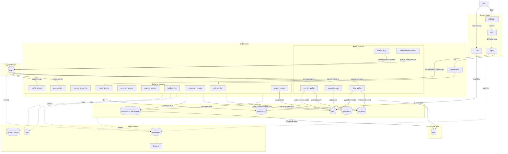
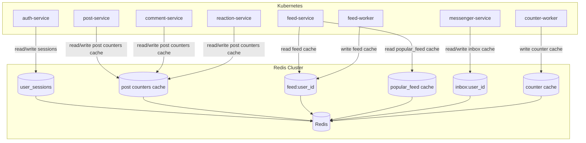
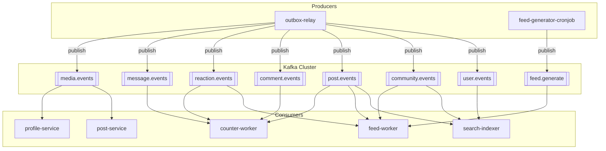
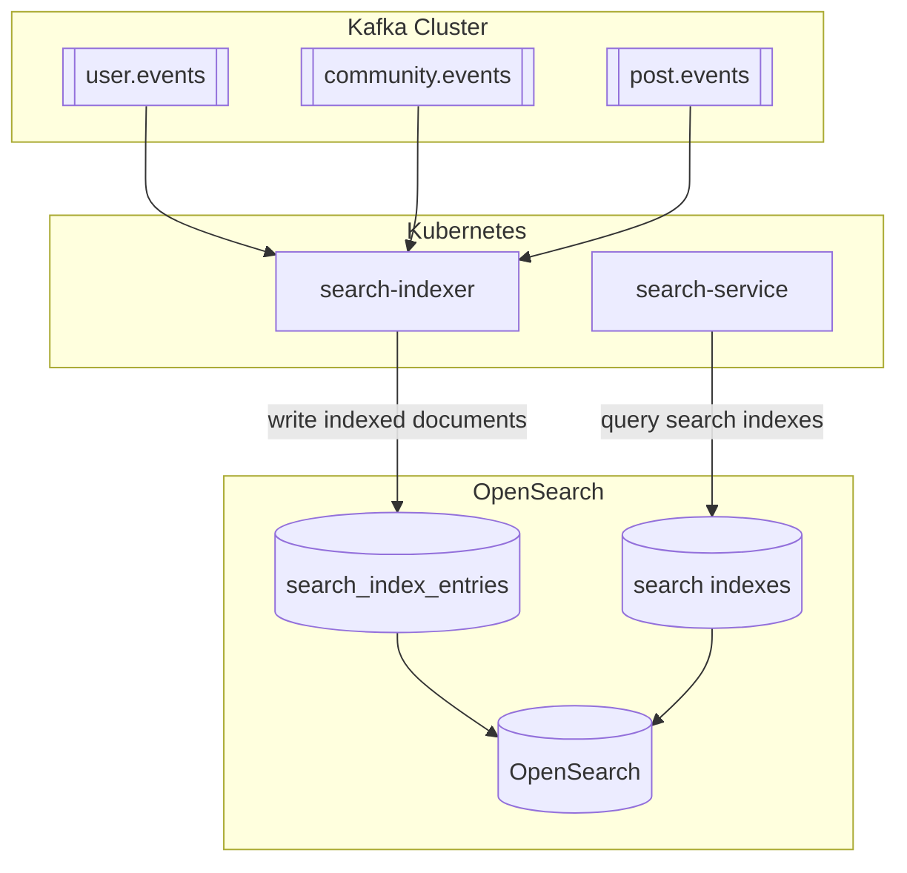
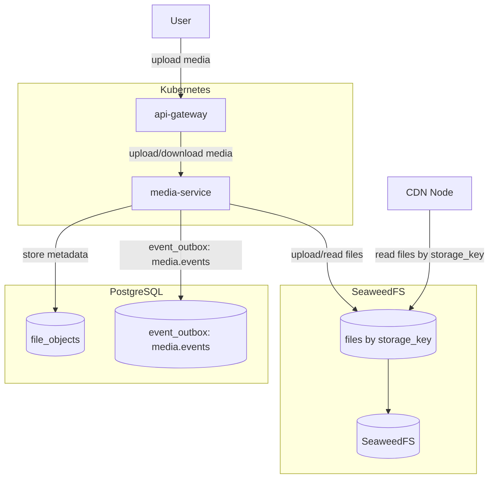

# 10. Схема проекта

- См. балансировку [ДЗ 3](./03.md) и [ДЗ 4](./04.md)
- MSK - primary, SBP и EKB - secondary
- Запись в PostgreSQL проксируется в primary DC `MSK`. Чтение может идти из любого ДЦ, если допустима неактуальность. Строго актуальные чтения идут в primary.
- Запись в SeaweedFS идет в primary DC. Чтение идет из локального ДЦ или через CDN. Актуальный `storage_key` хранится в PostgreSQL.
- Запись в ScyllaDB идет в любой ДЦ с `LOCAL_QUORUM`. Между ДЦ данные реплицируются асинхронно, модель консистентности - eventual consistency.
- Kafka используется для асинхронной обработки событий внутри каждого ДЦ. Между ДЦ события реплицируются асинхронно только для восстановления read-model после failover; синхронного ожидания меж-ДЦ Kafka в пользовательском запросе нет.
- Redis используется как локальный кеш в каждом ДЦ и не является source of truth.

## Микросервисы в Kubernetes

| Сервис                   | Назначение                                          | Основные таблицы / хранилища                                                   |
| :----------------------- | :-------------------------------------------------- | :----------------------------------------------------------------------------- |
| `api-gateway`            | Единая точка входа API, auth middleware, rate limit | Redis                                                                          |
| `auth-service`           | Регистрация, логин, refresh token, logout           | `users`, `user_sessions`                                                       |
| `profile-service`        | Профиль пользователя, аватар, публичные данные      | `user_profiles`, `file_objects`                                                |
| `community-service`      | Создание сообществ, настройки, подписки             | `communities`, `community_counters`, `community_members`                       |
| `post-service`           | Создание и чтение постов                            | `posts`, `post_counters`, `post_attachments`, `file_objects`                   |
| `comment-service`        | Комментарии к постам                                | `comments`, `post_counters`                                                    |
| `reaction-service`       | Лайки и реакции                                     | `post_reactions_by_post`, `user_reactions_by_user`, `post_counters`            |
| `feed-service`           | Чтение персональной и популярной ленты              | `user_feed_items`, `popular_feed_items`, Redis                                 |
| `feed-generator-cronjob` | Периодическая генерация ленты                       | `posts`, `community_members`, `user_feed_items`, `popular_feed_items`          |
| `messenger-service`      | Диалоги и текстовые сообщения                       | `conversations`, `conversation_participants`, `user_conversations`, `messages` |
| `media-service`          | Загрузка фото, видео, аватаров                      | `file_objects`, SeaweedFS                                                      |
| `search-service`         | Поиск по пользователям, сообществам, постам         | OpenSearch                                                                     |
| `outbox-relay`           | Чтение `event_outbox` и публикация событий в Kafka  | `event_outbox`, Kafka                                                          |
| `feed-worker`            | Обновление read-model ленты по событиям             | Kafka, `user_feed_items`, `popular_feed_items`, Redis                          |
| `search-indexer`         | Обновление поискового индекса                       | Kafka, OpenSearch                                                              |
| `counter-worker`         | Асинхронное обновление snapshot-счетчиков           | Kafka, `post_counters`, `community_counters`, `user_conversations`, Redis      |

## Kafka topics

Бизнес-сервисы не пишут в Kafka напрямую: они сохраняют событие в `event_outbox`, а `outbox-relay` публикует его в нужный topic. Исключение - `feed-generator-cronjob`, который создает технические задачи в `feed.generate`.

| Topic              | Источник события                  | Кто читает                                        | Назначение                                |
| :----------------- | :-------------------------------- | :------------------------------------------------ | :---------------------------------------- |
| `user.events`      | `auth-service`, `profile-service` | `search-indexer`, `feed-worker`                   | Изменения пользователя и профиля          |
| `community.events` | `community-service`               | `feed-worker`, `search-indexer`                   | Изменения сообществ и подписок            |
| `post.events`      | `post-service`                    | `feed-worker`, `search-indexer`, `counter-worker` | Создание, обновление, удаление постов     |
| `comment.events`   | `comment-service`                 | `counter-worker`                                  | Создание и удаление комментариев          |
| `reaction.events`  | `reaction-service`                | `counter-worker`, `feed-worker`                   | Лайки и реакции                           |
| `message.events`   | `messenger-service`               | `counter-worker`                                  | Новые сообщения и счетчики диалогов       |
| `media.events`     | `media-service`                   | `post-service`, `profile-service`                 | Готовность файлов, аватаров и превью      |
| `feed.generate`    | `feed-generator-cronjob`          | `feed-worker`                                     | Задачи на пересборку read-model ленты     |

Для всех topics используется at-least-once delivery: consumer коммитит offset только после успешной идемпотентной обработки. Ключ партиционирования выбирается по основной сущности (`user_id`, `community_id`, `post_id`, `conversation_id`), чтобы сохранить порядок событий внутри одной сущности. После исчерпания retry событие попадает в DLQ соответствующего домена.

## Общая схема

## PostgreSQL

PostgreSQL хранит строго консистентные данные, метаданные и transactional outbox. Запись идет в primary DC `MSK`; чтения из secondary DC допустимы только там, где приложение может пережить небольшое отставание реплики.

```mermaid
flowchart TB
    subgraph k8s["Kubernetes"]
        Auth[auth-service]
        Profile[profile-service]
        Community[community-service]
        Post[post-service]
        Comment[comment-service]
        Reaction[reaction-service]
        Messenger[messenger-service]
        MediaSvc[media-service]

        OutboxRelay[outbox-relay]
        CounterWorker[counter-worker]
    end

    subgraph Postgres["PostgreSQL HA / Patroni"]
        PG[(Postgres)]

        Users[(users)]
        Profiles[(user_profiles)]
        FileObjects[(file_objects)]
        Communities[(communities)]
        CommunityCounters[(community_counters)]
        Conversations[(conversations)]
        EventOutbox[(event_outbox)]
    end

    Auth -->|users| Users
    Auth -->|event_outbox: user.events| EventOutbox

    Profile -->|user_profiles| Profiles
    Profile -->|file_objects| FileObjects
    Profile -->|event_outbox: user.events| EventOutbox

    Community -->|communities| Communities
    Community -->|community_counters| CommunityCounters
    Community -->|event_outbox: community.events| EventOutbox

    Post -->|file_objects| FileObjects
    Post -->|event_outbox: post.events| EventOutbox

    Comment -->|event_outbox: comment.events| EventOutbox

    Reaction -->|event_outbox: reaction.events| EventOutbox

    Messenger -->|conversations| Conversations
    Messenger -->|event_outbox: message.events| EventOutbox

    MediaSvc -->|file_objects| FileObjects
    MediaSvc -->|event_outbox: media.events| EventOutbox

    CounterWorker -->|update community_counters| CommunityCounters

    OutboxRelay -->|read event_outbox| EventOutbox

    Users --> PG
    Profiles --> PG
    FileObjects --> PG
    Communities --> PG
    CommunityCounters --> PG
    Conversations --> PG
    EventOutbox --> PG
```

## ScyllaDB

ScyllaDB хранит высоконагруженные сущности, которые читаются по заранее заданным ключам: посты, комментарии, реакции, ленты и сообщения. Запись идет в локальный ДЦ с `LOCAL_QUORUM`; между ДЦ данные сходятся асинхронно.

```mermaid
flowchart TB
    subgraph k8s["Kubernetes"]
        Community[community-service]
        Post[post-service]
        Comment[comment-service]
        Reaction[reaction-service]
        Feed[feed-service]
        FeedCron[feed-generator-cronjob]
        Messenger[messenger-service]

        FeedWorker[feed-worker]
        CounterWorker[counter-worker]
    end

    subgraph ScyllaDB["ScyllaDB"]
        Scylla[(ScyllaDB)]

        CommunityMembers[(community_members)]

        Posts[(posts)]
        PostCounters[(post_counters)]
        PostAttachments[(post_attachments)]

        Comments[(comments)]

        PostReactionsByPost[(post_reactions_by_post)]
        UserReactionsByUser[(user_reactions_by_user)]

        UserFeedItems[(user_feed_items)]
        PopularFeedItems[(popular_feed_items)]

        ConversationParticipants[(conversation_participants)]
        UserConversations[(user_conversations)]
        Messages[(messages)]
    end

    Community -->|community_members| CommunityMembers

    Post -->|posts| Posts
    Post -->|post_counters| PostCounters
    Post -->|post_attachments| PostAttachments

    Comment -->|comments| Comments
    Comment -->|post_counters| PostCounters

    Reaction -->|post_reactions_by_post| PostReactionsByPost
    Reaction -->|user_reactions_by_user| UserReactionsByUser
    Reaction -->|post_counters| PostCounters

    Feed -->|user_feed_items| UserFeedItems
    Feed -->|popular_feed_items| PopularFeedItems

    FeedCron -->|read posts| Posts
    FeedCron -->|read community_members| CommunityMembers

    Messenger -->|conversation_participants| ConversationParticipants
    Messenger -->|user_conversations| UserConversations
    Messenger -->|messages| Messages

    FeedWorker -->|write user_feed_items| UserFeedItems
    FeedWorker -->|write popular_feed_items| PopularFeedItems

    CounterWorker -->|update post_counters| PostCounters
    CounterWorker -->|update unread counters| UserConversations

    CommunityMembers --> Scylla
    Posts --> Scylla
    PostCounters --> Scylla
    PostAttachments --> Scylla
    Comments --> Scylla
    PostReactionsByPost --> Scylla
    UserReactionsByUser --> Scylla
    UserFeedItems --> Scylla
    PopularFeedItems --> Scylla
    ConversationParticipants --> Scylla
    UserConversations --> Scylla
    Messages --> Scylla
```

## Redis

Redis используется как локальный кеш в каждом ДЦ: сессии, первые страницы ленты, inbox и счетчики. При потере кеша данные восстанавливаются из PostgreSQL или ScyllaDB.

## Kafka

Kafka связывает сервисы асинхронно. Основной путь публикации бизнес-событий идет через `event_outbox` и `outbox-relay`;
`feed-generator-cronjob` напрямую публикует задачи на пересборку лент в `feed.generate`.
Kafka-кластер локален для ДЦ. Для переключения трафика между ДЦ допускается асинхронная репликация topics, но пользовательский запрос не ждет подтверждения из другого ДЦ.

## OpenSearch

OpenSearch хранит поисковые индексы пользователей, сообществ и постов.
Индекс обновляется асинхронно из Kafka; при потере индекса его можно пересобрать из событий и canonical storage.

## SeaweedFS

SeaweedFS хранит файлы по `storage_key`, а PostgreSQL хранит метаданные в `file_objects`.
Загрузка идет через `media-service` в primary DC,
а чтение может идти через CDN, который ходит в любой SeaweedFS и кеширует файлы.

## Особенности работы в 3 ДЦ

| Компонент  | Правило                                                                                                                                        |
| :--------- | :--------------------------------------------------------------------------------------------------------------------------------------------- |
| PostgreSQL | Запись проксируется в primary DC `MSK`. Чтение может идти из любого ДЦ, если допустима неактуальность. Строго актуальные чтения идут в primary |
| ScyllaDB   | Запись идет в любой ДЦ с `LOCAL_QUORUM`. Между ДЦ данные реплицируются eventual consistency                                                    |
| Redis      | Локальный кеш в каждом ДЦ. Не является source of truth                                                                                         |
| SeaweedFS  | Запись идет в primary DC. Чтение идет из локального ДЦ или через CDN                                                                           |
| Kafka      | Локальный кластер в каждом ДЦ. Между ДЦ topics реплицируются асинхронно для восстановления read-model, не в синхронном пути запроса            |
| OpenSearch | Индекс обновляется асинхронно из Kafka. При потере индекса его можно пересобрать из событий и БД                                               |

## Локальные кеши в каждом ДЦ

| Кеш                      | Где хранится | Source of truth                 | Назначение                          |
| :----------------------- | :----------- | :------------------------------ | :---------------------------------- |
| `session:{key}`          | Redis        | PostgreSQL                      | Проверка авторизации                |
| `feed:{user_id}`         | Redis        | `user_feed_items` в ScyllaDB    | Быстрое чтение первых страниц ленты |
| `popular_feed:{region}`  | Redis        | `popular_feed_items` в ScyllaDB | Быстрое чтение популярной ленты     |
| `inbox:{user_id}`        | Redis        | `user_conversations` в ScyllaDB | Быстрое чтение списка диалогов      |
| `post_counter:{post_id}` | Redis        | `post_counters` в ScyllaDB      | Быстрое отображение счетчиков       |

## Генерации ленты

| Worker                   | Периодичность    | Что делает                                                                             |
| :----------------------- | :--------------- | :------------------------------------------------------------------------------------- |
| `feed-generator-cronjob` | каждые 1-5 минут | Находит новые/популярные посты, формирует задачи в `feed.generate`                     |
| `feed-worker`            | постоянно        | Читает `feed.generate`, обновляет `user_feed_items`, `popular_feed_items`, Redis cache |
| `search-indexer`         | постоянно        | Читает события и обновляет OpenSearch                                                  |
| `counter-worker`         | постоянно        | Читает события комментариев/реакций/постов/сообщений и обновляет счетчики               |

<!-- CronJob не является source of truth. Он только пересобирает read-model лент. -->
